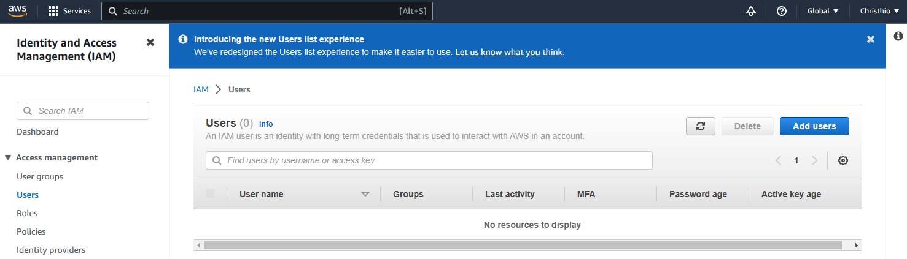
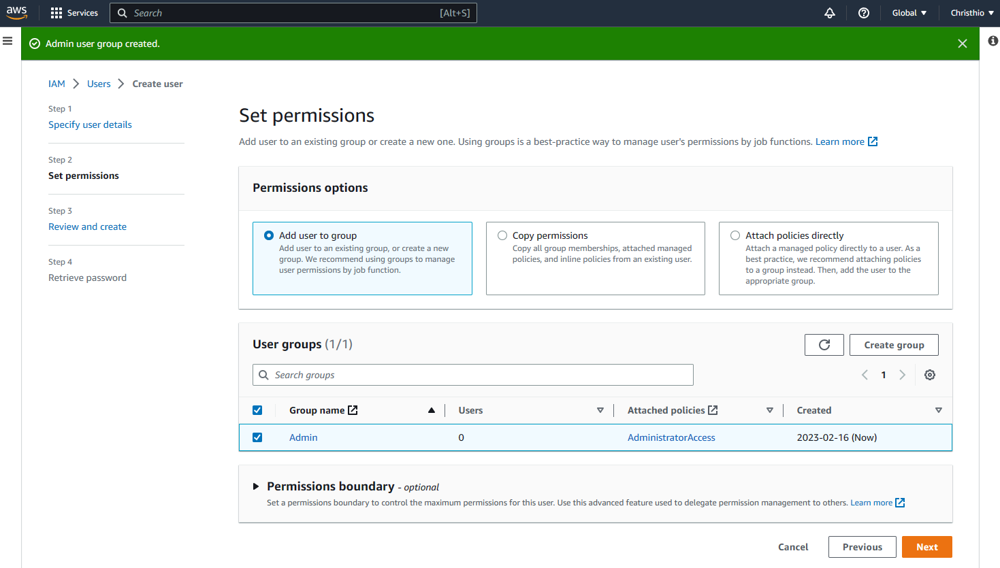
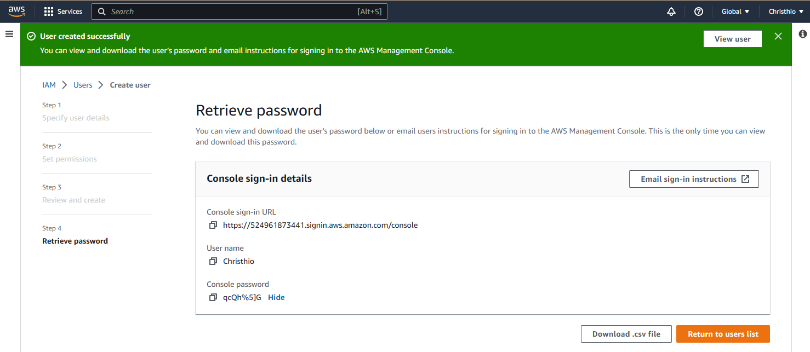
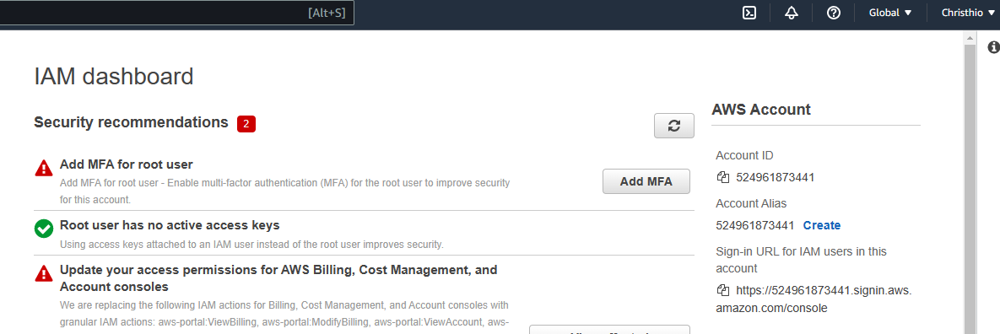
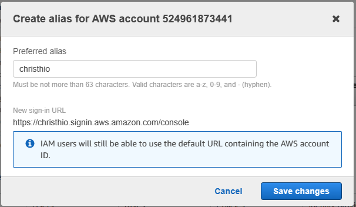
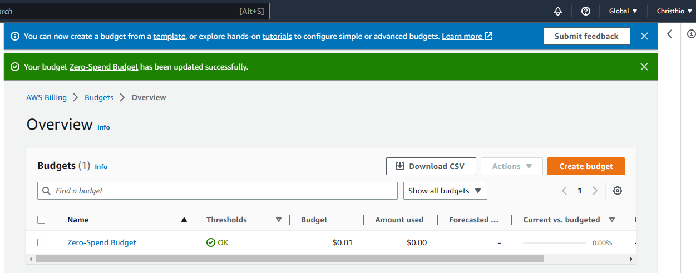

# Week 0 — Billing and Architecture

## Required Homework/Tasks

### Create an Admin User
Navigate to IAM to create new admin user. 

Then I created new "Admin" group with AdministratorAccess role.

After creating the account, Console sign-in details will be displayed.

I copied the console password and used the console sign-in URL to login as new user.
Once I login with the temporary password, I updated with new password by using auto-generated password from https://passwordsgenerator.net/

As Account ID is difficult to remember, I login as root user to create my account alias

### Use CloudShell

### Generate AWS Credentials

### Install AWS CLI

### Create a Billing Alarm

### Create a Budget
I created a budget from AWS Billing so that an email notification will be sent to me once I have exceeded AWS Free Tier.
The threshold I set is $0.01.

## Homework Challenges

### Destroy your root account credentials, Set MFA, IAM role
