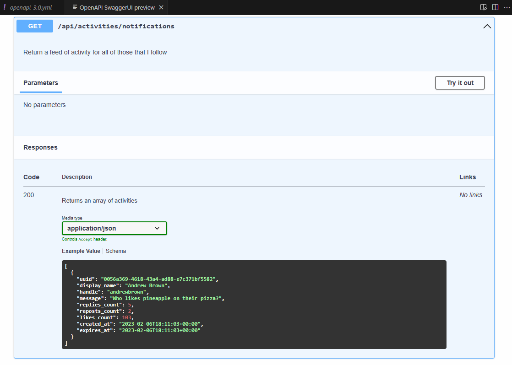
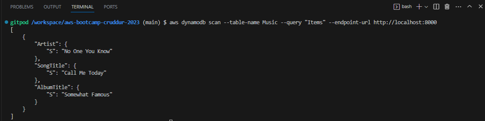

# Week 1 — App Containerization

## Required Homework/Tasks

### Containerize Application (Dockerfiles, Docker Compose)

#### Containerize Backend

1. Create a Dockerfile under `backend-flask/Dockerfile`.
    ```dockerfile
    FROM python:3.10-slim-buster

    # Inside Container
    # make a new folder inside container
    WORKDIR /backend-flask

    # Outside Container -> Inside Container
    # this contains the libraries to be installed to run the app
    COPY requirements.txt requirements.txt

    # Inside Container
    # Install the python libraries used for the app
    RUN pip3 install -r requirements.txt

    # Outside Container -> Inside Container
    # means everything in the current directory
    # first period /backend-flask (outside container)
    # second period /backend-flask (inside container)
    COPY . .


    # Set Environment Variables
    # Inside Container and will remain set when the container is running
    ENV FLASK_ENV=development

    EXPOSE ${PORT}
    CMD [ "python3", "-m" , "flask", "run", "--host=0.0.0.0", "--port=4567"]
    ```
2. Build container.
    ```sh
    docker build -t  backend-flask-image ./backend-flask
    ```
    
    
    
3. Run container.
    ```sh
    export FRONTEND_URL="*"
    export BACKEND_URL="*"
    docker run --rm -p 4567:4567 -it -e FRONTEND_URL='*' -e BACKEND_URL='*' backend-flask-image
    ```
    
    
    To unset environment variable.
    ```sh
    unset FRONTEND_URL="*"
    unset BACKEND_URL="*"
    ```
    
    To run container in background.
    ```sh
    docker container run --rm -p 4567:4567 -d backend-flask-image
    ```
4. Check whether it's working by appending `/api/message_groups`.
 
   

#### Containerize Frontend

1. Run NPM Install.
   We have to run NPM Install before building the container since it needs to copy the contents of node_modules.
   ```sh
   cd frontend-react-js
   npm i
   ```
2. Create a Dockerfile under `frontend-react-js/Dockerfile`.
   ```dockerfile
    FROM node:16.18

    ENV PORT=3000

    COPY . /frontend-react-js
    WORKDIR /frontend-react-js
    RUN npm install
    EXPOSE ${PORT}
    CMD ["npm", "start"]
   ```
3. Build Container.
   ```sh
   docker build -t frontend-react-js-image ./frontend-react-js
   ```
   
   
   
4. Run Container.
   ```sh
   docker run -p 3000:3000 -d frontend-react-js-image
   ```
   
5. Test the page.
   


#### Running Multiple Containers (Docker Compose)

1. Create `docker-compose.yml` at the root of the project.

    ```yaml
    version: "3.8"
    services:
      backend-flask:
        environment:
          FRONTEND_URL: "https://3000-${GITPOD_WORKSPACE_ID}.${GITPOD_WORKSPACE_CLUSTER_HOST}"
          BACKEND_URL: "https://4567-${GITPOD_WORKSPACE_ID}.${GITPOD_WORKSPACE_CLUSTER_HOST}"
        build: ./backend-flask
        ports:
          - "4567:4567"
        volumes:
          - ./backend-flask:/backend-flask
      frontend-react-js:
        environment:
          REACT_APP_BACKEND_URL: "https://4567-${GITPOD_WORKSPACE_ID}.${GITPOD_WORKSPACE_CLUSTER_HOST}"
        build: ./frontend-react-js
        ports:
          - "3000:3000"
        volumes:
          - ./frontend-react-js:/frontend-react-js

    # the name flag is a hack to change the default prepend folder
    # name when outputting the image names
    networks: 
      internal-network:
        driver: bridge
        name: cruddur
    ```
2. Run `docker compose up` or right-click on `docker-compose.yml` and select 'Compose Up'.
   
3. Check the page.
   


### Document the Notification Endpoint for the OpenAPI Document

To document the notification endpoint, edit `openapi-3.0.yml` file under `backend-flask`.
```yaml
/api/activities/notifications:
    get:
      description: 'Return a feed of activity for all of those that I follow'
      tags:
        - activities
      parameters: []
      responses:
        '200':
          description: Returns an array of activities
          content:
            application/json:
              schema:
                type: array
                items:
                  $ref: '#/components/schemas/Activity'
```

The result is as follows in the OpenAPI SwaggerUI preview.


### Write a Flask Backend Endpoint for Notifications

Create a new file `backend-flask/services/notifications_activities.py`.

```py
from datetime import datetime, timedelta, timezone
class NotificationsActivities:
def run():
    now = datetime.now(timezone.utc).astimezone()
    results = [{
      'uuid': '68f126b0-1ceb-4a33-88be-d90fa7109eee',
      'handle':  'Watsons',
      'message': 'I have all the best products',
      'created_at': (now - timedelta(days=2)).isoformat(),
      'expires_at': (now + timedelta(days=5)).isoformat(),
      'likes_count': 5,
      'replies_count': 1,
      'reposts_count': 0,
      'replies': [{
        'uuid': '26e12864-1c26-5c3a-9658-97a10f8fea67',
        'reply_to_activity_uuid': '68f126b0-1ceb-4a33-88be-d90fa7109eee',
        'handle':  'Worf',
        'message': 'This post has no honor!',
        'likes_count': 0,
        'replies_count': 0,
        'reposts_count': 0,
        'created_at': (now - timedelta(days=2)).isoformat()
      }],
    }]
    return results
```
Update `backend-flask/app.py`.

```py
#Import notifications activities
from services.notifications_activities import *

@app.route("/api/activities/notifications", methods=['GET'])
def data_notifications():
  data = NotificationsActivities.run()
  return data, 200
```


### Write a React Page for Notifications

Create a new empty file `frontend-react-js/src/pages/NotificationsFeedPage.css`.

Create a new file `frontend-react-js/src/pages/NotificationsFeedPage.js`.

```js
import './NotificationsFeedPage.css';
import React from "react";

import DesktopNavigation  from '../components/DesktopNavigation';
import DesktopSidebar     from '../components/DesktopSidebar';
import ActivityFeed from '../components/ActivityFeed';
import ActivityForm from '../components/ActivityForm';
import ReplyForm from '../components/ReplyForm';

// [TODO] Authenication
import Cookies from 'js-cookie'

export default function NotificationsFeedPage() {
  const [activities, setActivities] = React.useState([]);
  const [popped, setPopped] = React.useState(false);
  const [poppedReply, setPoppedReply] = React.useState(false);
  const [replyActivity, setReplyActivity] = React.useState({});
  const [user, setUser] = React.useState(null);
  const dataFetchedRef = React.useRef(false);

  const loadData = async () => {
    try {
      const backend_url = `${process.env.REACT_APP_BACKEND_URL}/api/activities/notifications`
      const res = await fetch(backend_url, {
        method: "GET"
      });
      let resJson = await res.json();
      if (res.status === 200) {
        setActivities(resJson)
      } else {
        console.log(res)
      }
    } catch (err) {
      console.log(err);
    }
  };

  const checkAuth = async () => {
    console.log('checkAuth')
    // [TODO] Authenication
    if (Cookies.get('user.logged_in')) {
      setUser({
        display_name: Cookies.get('user.name'),
        handle: Cookies.get('user.username')
      })
    }
  };

  React.useEffect(()=>{
    //prevents double call
    if (dataFetchedRef.current) return;
    dataFetchedRef.current = true;

    loadData();
    checkAuth();
  }, [])

  return (
    <article>
      <DesktopNavigation user={user} active={'notifications'} setPopped={setPopped} />
      <div className='content'>
        <ActivityForm  
          popped={popped}
          setPopped={setPopped} 
          setActivities={setActivities} 
        />
        <ReplyForm 
          activity={replyActivity} 
          popped={poppedReply} 
          setPopped={setPoppedReply} 
          setActivities={setActivities} 
          activities={activities} 
        />
        <ActivityFeed 
          title="Notifications" 
          setReplyActivity={setReplyActivity} 
          setPopped={setPoppedReply} 
          activities={activities} 
        />
      </div>
      <DesktopSidebar user={user} />
    </article>
  );
}
```

Update `frontend-react-js/src/App.js` file.

```js
import NotificationsFeedPage from './pages/NotificationsFeedPage';

{
    path: "/notifications",
    element: <NotificationsFeedPage />
}
```

The result will be as follows.


### Run DynamoDB Local Container and ensure it works

Copy the following code to `docker-compose.yml` file.

```yml
services:
  dynamodb-local:
    # https://stackoverflow.com/questions/67533058/persist-local-dynamodb-data-in-volumes-lack-permission-unable-to-open-databa
    # We needed to add user:root to get this working.
    user: root
    command: "-jar DynamoDBLocal.jar -sharedDb -dbPath ./data"
    image: "amazon/dynamodb-local:latest"
    container_name: dynamodb-local
    ports:
      - "8000:8000"
    volumes:
      - "./docker/dynamodb:/home/dynamodblocal/data"
    working_dir: /home/dynamodblocal
```

Run compose up on `docker-compose.yml` file.

To ensure it works, we can copy the commands from https://github.com/100DaysOfCloud/challenge-dynamodb-local.

#### Create a Table

```sh
aws dynamodb create-table \
    --endpoint-url http://localhost:8000 \
    --table-name Music \
    --attribute-definitions \
        AttributeName=Artist,AttributeType=S \
        AttributeName=SongTitle,AttributeType=S \
    --key-schema AttributeName=Artist,KeyType=HASH AttributeName=SongTitle,KeyType=RANGE \
    --provisioned-throughput ReadCapacityUnits=1,WriteCapacityUnits=1 \
    --table-class STANDARD
```

#### Create an Item

```sh
aws dynamodb put-item \
    --endpoint-url http://localhost:8000 \
    --table-name Music \
    --item \
        '{"Artist": {"S": "No One You Know"}, "SongTitle": {"S": "Call Me Today"}, "AlbumTitle": {"S": "Somewhat Famous"}}' \
    --return-consumed-capacity TOTAL  
```

#### List Tables

```sh
aws dynamodb list-tables --endpoint-url http://localhost:8000
```


#### Get Records

```sh
aws dynamodb scan --table-name Music --query "Items" --endpoint-url http://localhost:8000
```



### Run Postgres Container and ensure it works

Copy the following code to `docker-compose.yml` file.

```yml
services:
  db:
    image: postgres:13-alpine
    restart: always
    environment:
      - POSTGRES_USER=postgres
      - POSTGRES_PASSWORD=password
    ports:
      - '5432:5432'
    volumes: 
      - db:/var/lib/postgresql/data
volumes:
  db:
    driver: local
```

Add the following commands into `gitpod.yml` file.

```yml
  - name: postgres
    init: |
      curl -fsSL https://www.postgresql.org/media/keys/ACCC4CF8.asc|sudo gpg --dearmor -o /etc/apt/trusted.gpg.d/postgresql.gpg
      echo "deb http://apt.postgresql.org/pub/repos/apt/ `lsb_release -cs`-pgdg main" |sudo tee  /etc/apt/sources.list.d/pgdg.list
      sudo apt update
      sudo apt install -y postgresql-client-13 libpq-dev
```

Install PostgreSQL extension into gitpod.io and add into `gitpod.yml` file.
```yml
extensions:
    - cweijan.vscode-postgresql-client2
```

To test whether it's working by using this command.
```sh
psql -Upostgres --host localhost

\dl
\l
```


