# Week 2 — Distributed Tracing

## Required Homework/Tasks

### Instrument Honeycomb with OTEL

1. Create an account on honeycomb.io.
2. Launch a new workspace on gitpod.io.
3. Add the following env variables to `backend-flask` services/environment in `docker-compose.yml`.

   ```yml
   OTEL_EXPORTER_OTLP_ENDPOINT: "https://api.honeycomb.io"
   OTEL_EXPORTER_OTLP_HEADERS: "x-honeycomb-team=${HONEYCOMB_API_KEY}"
   OTEL_SERVICE_NAME: "backend-flask"
   ```
4. Go to honeycomb account and create a new environment. In the screenshot below, I create a new environment called "AWS Bootcamp".
   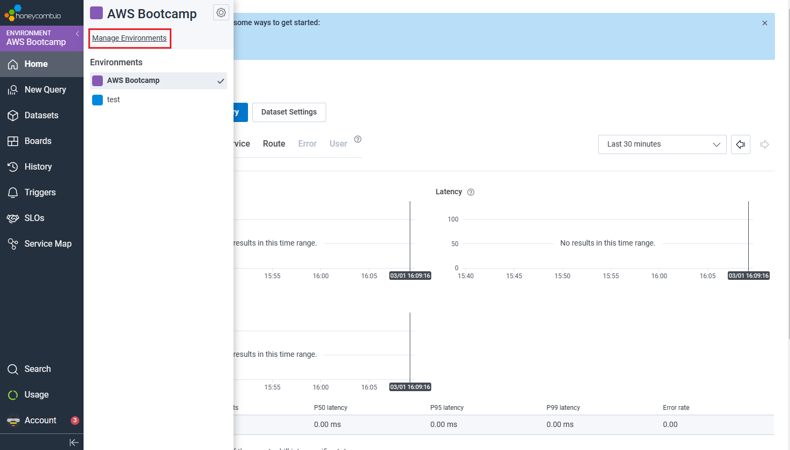
   
5. Once it's created, go to the Settings and find its API keys.
   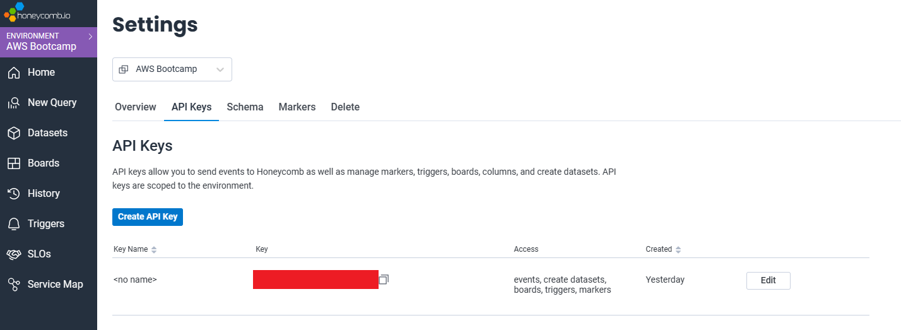
  
6. Add the API keys to gitpod environment with the following commands.

   ```sh
   export HONEYCOMB_API_KEY=""
   export HONEYCOMB_SERVICE_NAME="Cruddur"
   gp env HONEYCOMB_API_KEY=""
   gp env HONEYCOMB_SERVICE_NAME="Cruddur"
   ```
7. Append the following files to `backend-flask / requirements.txt`.  
   *(Reference: https://docs.honeycomb.io/getting-data-in/opentelemetry/python/)*
   
   ```sh
   opentelemetry-api 
   opentelemetry-sdk 
   opentelemetry-exporter-otlp-proto-http 
   opentelemetry-instrumentation-flask 
   opentelemetry-instrumentation-requests
   ```
8. Install the dependencies.
   
   ```sh
   pip install -r requirements.txt
   ```
9. Initiliase a tracer and Flask instrumentation to send data to Honeycomb in `app.py`.
   
   ```py
   from opentelemetry import trace
   from opentelemetry.instrumentation.flask import FlaskInstrumentor
   from opentelemetry.instrumentation.requests import RequestsInstrumentor
   from opentelemetry.exporter.otlp.proto.http.trace_exporter import OTLPSpanExporter
   from opentelemetry.sdk.trace import TracerProvider
   from opentelemetry.sdk.trace.export import BatchSpanProcessor
   ```
   
   ```py
   # HoneyComb -------------
   # Initialize tracing and an exporter that can send data to Honeycomb
   provider = TracerProvider()
   processor = BatchSpanProcessor(OTLPSpanExporter())
   provider.add_span_processor(processor)
   trace.set_tracer_provider(provider)
   tracer = trace.get_tracer(__name__)
   ```
   
   ```py
   # HoneyComb -------------
   # Initialize automatic instrumentation with Flask
   FlaskInstrumentor().instrument_app(app)
   RequestsInstrumentor().instrument()
   ```
   
   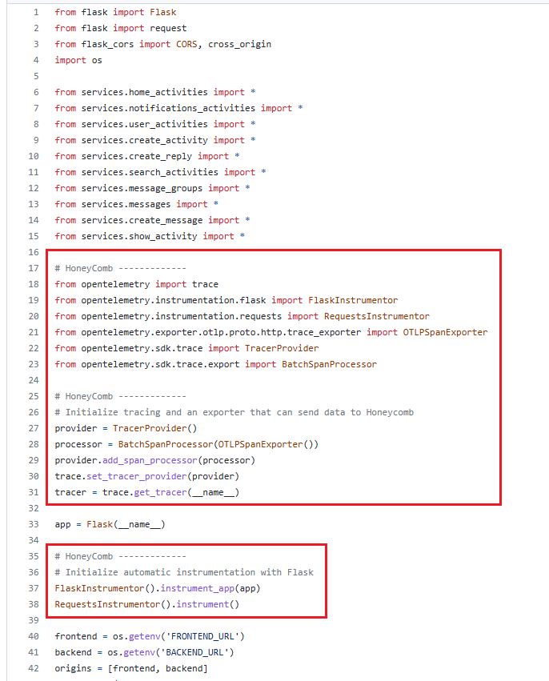
10. As tracer has been configured, we can create spans to describe what is happening in your application.
    Add the following lines in `home_activities.py`.
    
    ```py
    from opentelemetry import trace
    
    tracer = trace.get_tracer("home.activities")
    class HomeActivities:
    def run():
      with tracer.start_as_current_span("home-activities-mock-data"):
        span = trace.get_current_span()
        now = datetime.now(timezone.utc).astimezone()
        span.set_attribute("app.now", now.isoformat())
        ...
        span.set_attribute("app.result_length", len(results))
        return results
    ```
11. Run docker compose up.
12. Open backend-flask from gitpod.io and hit `/api/activities/home`.

    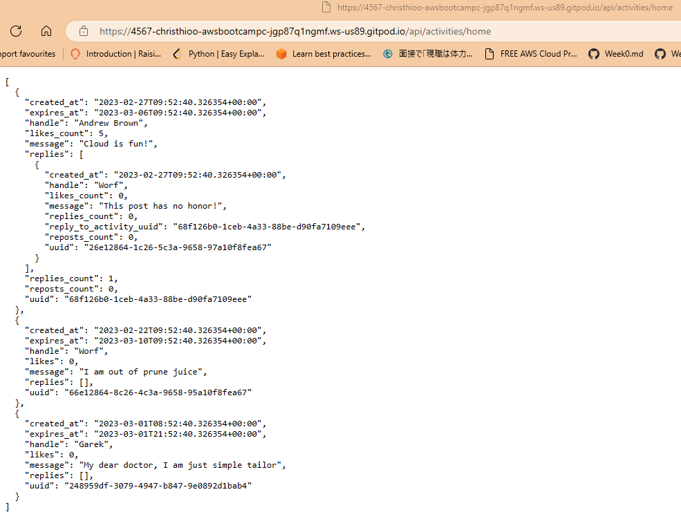
13. Once it has returned json data, navigate to honeycomb.io and click on the recent trace.

    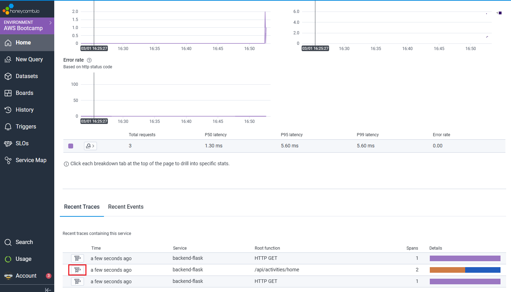
14. The attributes should be reflected on the right side bar.
    
    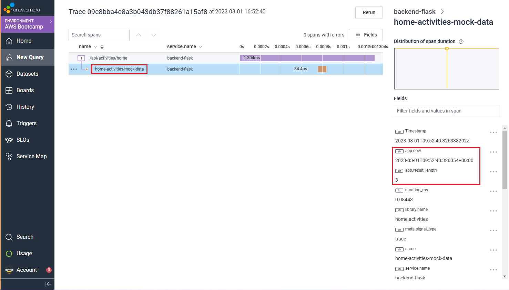

### Instrument AWS X-Ray

1. Add AWS X-Ray SDK for Python to `requirements.txt`.  
   *(Reference: https://github.com/aws/aws-xray-sdk-python)*
   
   ```txt
   aws-xray-sdk
   ```
2. Install python dependencies.

   ```sh
   pip install -r requirements.txt
   ```
3. Import the library to the `app.py`.

   ```py
   from aws_xray_sdk.core import xray_recorder
   from aws_xray_sdk.ext.flask.middleware import XRayMiddleware

   xray_url = os.getenv("AWS_XRAY_URL")
   xray_recorder.configure(service='Cruddur', dynamic_naming=xray_url)
   
   app = Flask(__name__)
   
   XRayMiddleware(app, xray_recorder)
   ```
4. Add Daemon Service to `docker-compose.yml`.

   ```yml
   xray-daemon:
    image: "amazon/aws-xray-daemon"
    environment:
      AWS_ACCESS_KEY_ID: "${AWS_ACCESS_KEY_ID}"
      AWS_SECRET_ACCESS_KEY: "${AWS_SECRET_ACCESS_KEY}"
      AWS_REGION: "us-east-1"
    command:
      - "xray -o -b xray-daemon:2000"
    ports:
      - 2000:2000/udp
   ```
5. Add these two environment variables to backend-flask in `docker-compose.yml` file.

   ```yml
   AWS_XRAY_URL: "*4567-${GITPOD_WORKSPACE_ID}.${GITPOD_WORKSPACE_CLUSTER_HOST}*"
   AWS_XRAY_DAEMON_ADDRESS: "xray-daemon:2000"
   ```
6. Create a new X-Ray group.
   
   ```sh
   aws xray create-group \
      --group-name "Cruddur" \
      --filter-expression "service(\"backend-flask\")"
   ```
   
   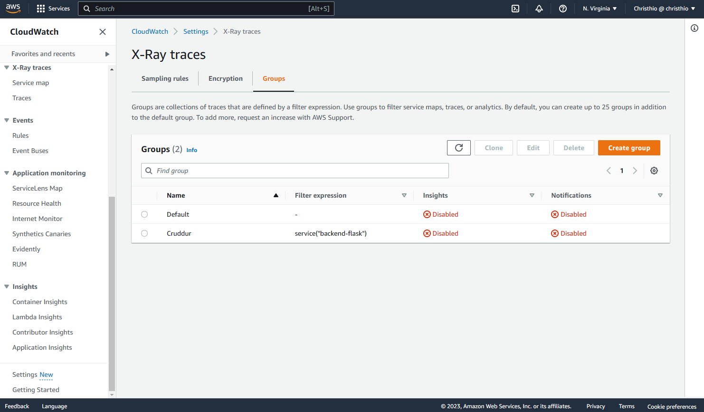
7. Create a new sampling rule file in `aws/json/xray.json`.

   ```json
   {
     "SamplingRule": {
         "RuleName": "Cruddur",
         "ResourceARN": "*",
         "Priority": 9000,
         "FixedRate": 0.1,
         "ReservoirSize": 5,
         "ServiceName": "Cruddur",
         "ServiceType": "*",
         "Host": "*",
         "HTTPMethod": "*",
         "URLPath": "*",
         "Version": 1
     }
   }
   ```
8. Create a new sampling rule for AWS X-Ray traces.

   ```sh
   aws xray create-sampling-rule --cli-input-json file://aws/json/xray.json
   ```
   
   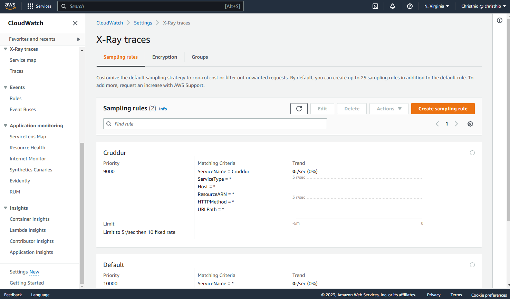
9. Run docker compose up.
10. Hit `/api/activities/home`.
11. The trace should be reflected on AWS X-Ray traces.

    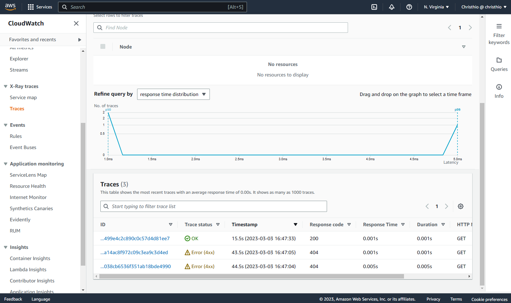
    
    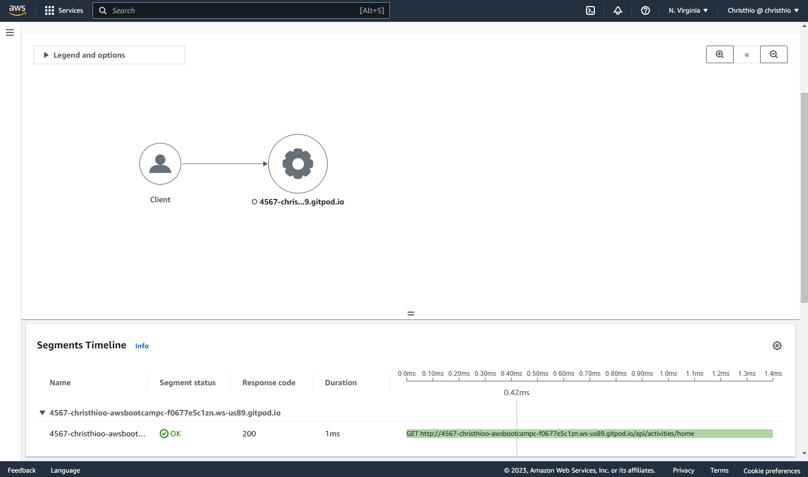
12. Add subsegment into `message_groups.py`.

    ```py
    subsegment = xray_recorder.begin_subsegment('first_mock_subsegment')
    
    ...
    
    dict = {
      "now": now.isoformat(),
      "size": len(model['data'])
    }
    subsegment.put_metadata('key', dict, 'namespace')
    xray_recorder.end_subsegment()
    ```
13. Hit `/api/message_groups`.
14. Check AWS X-Ray traces.

    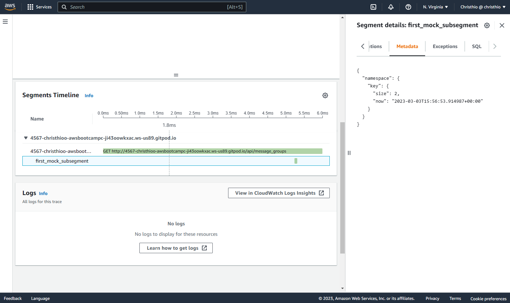  

### Configure custom logger to send to CloudWatch Logs

### Integrate Rollbar and capture and error
