# Week 3 — Decentralized Authentication

[Required Homework/Tasks](#required-homeworktasks)
- [Setup Cognito User Pool](#setup-cognito-user-pool)
- [Implement Custom Signin Page](#implement-custom-signin-page)
- [Implement Custom Signup Page](#implement-custom-signup-page)
- [Implement Custom Confirmation Page](#implement-custom-confirmation-page)
- [Implement Custom Recovery Page](#implement-custom-recovery-page)
- [Verify JWT Token Server Side](#verify-jwt-token-server-side)

[Homework Challenges](#homework-challenges)
- [Decouple the JWT verify from the application code by writing a Flask Middleware](#decouple-the-jwt-verify-from-the-application-code-by-writing-a-flask-middleware)

## Required Homework/Tasks

### Setup Cognito User Pool

1. Navigate to AWS Cognito > User pools.

   
2. Create user pool.
3. For sign-in experience configuration step, follow the screenshot below.

   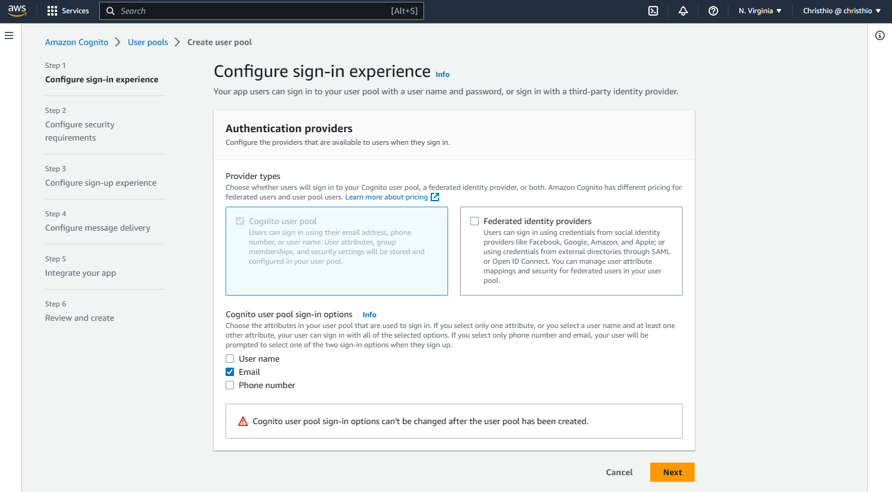
4. For security requirements configuration step, follow the screenshots below.
   For this bootcamp, 8 characters password length is sufficient.
   In addition, we use e-mail as a user account recovery method instead of SMS as we don't want incur extra cost for the bootcamp.

   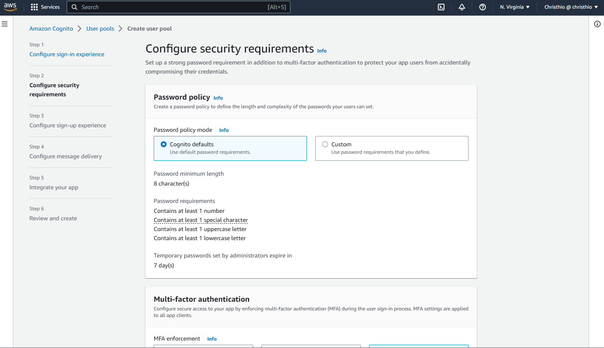
   
   
5. For sign-up experience configuration step, follow the screenshots below.

   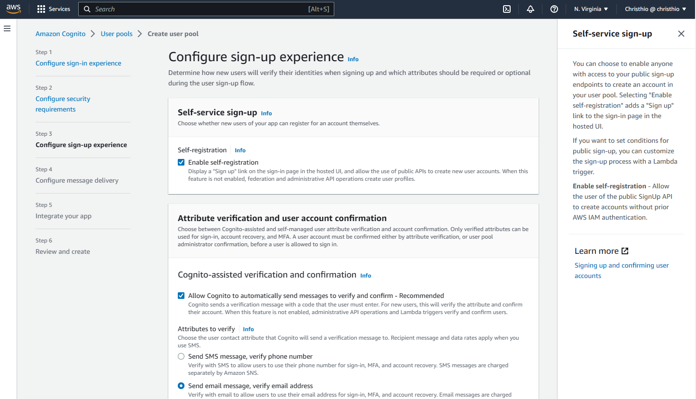
   
   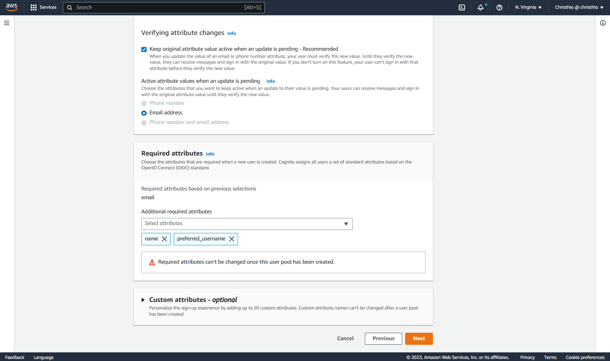
6. For message delivery configuration step, follow the screenshot below.

   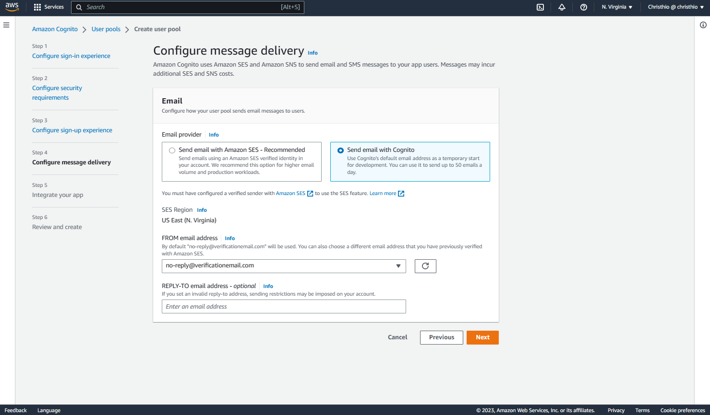
7. For integrate your app step, follow the screenshots below.

   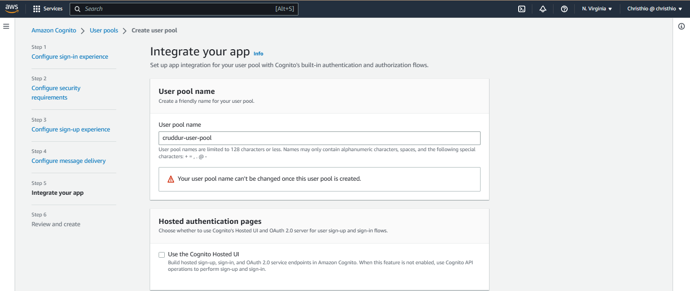
   
   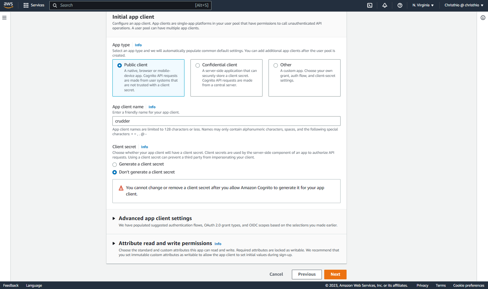
8. Review the configuration and click 'Create user pool'.

   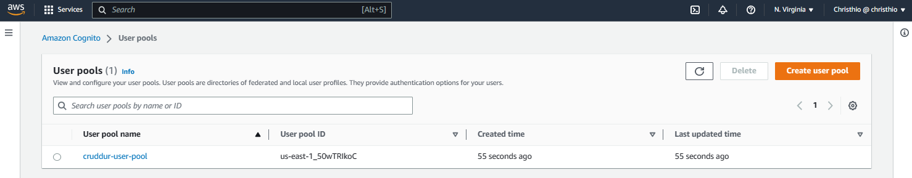

### Implement Custom Signin Page

1. Install AWS Amplify.
   
   ```sh
   npm i aws-amplify --save
   ```
2. Add environment variables to `frontend-react-js's environment` in `docker-compose.yml`.

   ```yml
   REACT_APP_AWS_PROJECT_REGION: "${AWS_DEFAULT_REGION}"
   REACT_APP_AWS_COGNITO_REGION: "${AWS_DEFAULT_REGION}"
   REACT_APP_AWS_USER_POOLS_ID: "us-east-1_nNyvfnegi"
   REACT_APP_CLIENT_ID: "5mhavv9qbf2k41d1fc15ge4587"
   ```
   Note that REACT_APP_AWS_USER_POOLS_ID can be found user pools table list, while REACT_APP_CLIENT_ID can be found inside user pool's App Integration.
   
   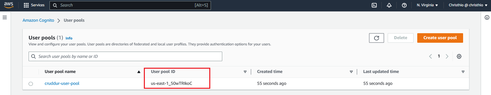
   
   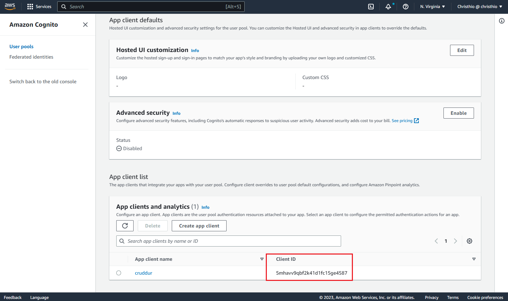
3. Configure AWS Amplify in `App.js` under frontend-react-js.

   ```js
   import { Amplify } from 'aws-amplify';

   Amplify.configure({
     "AWS_PROJECT_REGION": process.env.REACT_APP_AWS_PROJECT_REGION,
     "aws_cognito_region": process.env.REACT_APP_AWS_COGNITO_REGION,
     "aws_user_pools_id": process.env.REACT_APP_AWS_USER_POOLS_ID,
     "aws_user_pools_web_client_id": process.env.REACT_APP_CLIENT_ID,
     "oauth": {},
     Auth: {
       // We are not using an Identity Pool
       // identityPoolId: process.env.REACT_APP_IDENTITY_POOL_ID, // REQUIRED - Amazon Cognito Identity Pool ID
       region: process.env.REACT_APP_AWS_PROJECT_REGION,           // REQUIRED - Amazon Cognito Region
       userPoolId: process.env.REACT_APP_AWS_USER_POOLS_ID,         // OPTIONAL - Amazon Cognito User Pool ID
       userPoolWebClientId: process.env.REACT_APP_CLIENT_ID,   // OPTIONAL - Amazon Cognito Web Client ID (26-char alphanumeric string)
     }
   });
   ```
4. Set whether we are authenticated when we load page by replacing the existing code with the following code in `HomeFeedPage.js`.

   ```js
   import { Auth } from 'aws-amplify';

   // set a state
   const [user, setUser] = React.useState(null);

   // check if we are authenicated
   const checkAuth = async () => {
     Auth.currentAuthenticatedUser({
       // Optional, By default is false. 
       // If set to true, this call will send a 
       // request to Cognito to get the latest user data
       bypassCache: false 
     })
     .then((user) => {
       console.log('user',user);
       return Auth.currentAuthenticatedUser()
     }).then((cognito_user) => {
         setUser({
           display_name: cognito_user.attributes.name,
           handle: cognito_user.attributes.preferred_username
         })
     })
     .catch((err) => console.log(err));
   };

   // check when the page loads if we are authenicated
   React.useEffect(()=>{
     //prevents double call
     if (dataFetchedRef.current) return;
     dataFetchedRef.current = true;
     
     loadData();
     checkAuth();
   }, [])
   ```
5. Replace the function of `signOut` to the following code in `ProfileInfo.js`.

   ```js
   import { Auth } from 'aws-amplify';

   const signOut = async () => {
     try {
         await Auth.signOut({ global: true });
         window.location.href = "/"
     } catch (error) {
         console.log('error signing out: ', error);
     }
   }
   ```
6. Replace the function of `onsubmit` to the following code in `SigninPage.js`.

   ```js
   import { Auth } from 'aws-amplify';
   
   const [errors, setErrors] = React.useState('');

   const onsubmit = async (event) => {
     setErrors('')
     event.preventDefault();
     Auth.signIn(email, password)
      .then(user => {
        localStorage.setItem("access_token", user.signInUserSession.accessToken.jwtToken)
        window.location.href = "/"
      })
     .catch(error => {
       if (error.code == 'UserNotConfirmedException') {
         window.location.href = "/confirm"
       }
       setErrors(error.message)
     });
     return false
   }

   let el_errors;
   if (errors){
      el_errors = <div className='errors'>{errors}</div>;
   }
   ```
7. Create a user from the user pool on AWS Console.

   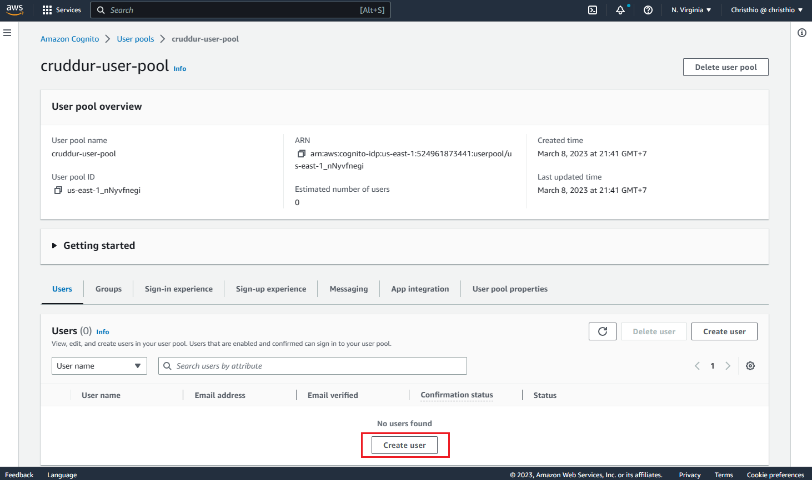
   
   
8. As the user's confirmation status is *Force change password*, and there's no way to change password from the AWS Console, we could use AWS CLI as found on https://stackoverflow.com/questions/40287012/how-to-change-user-status-force-change-password.

   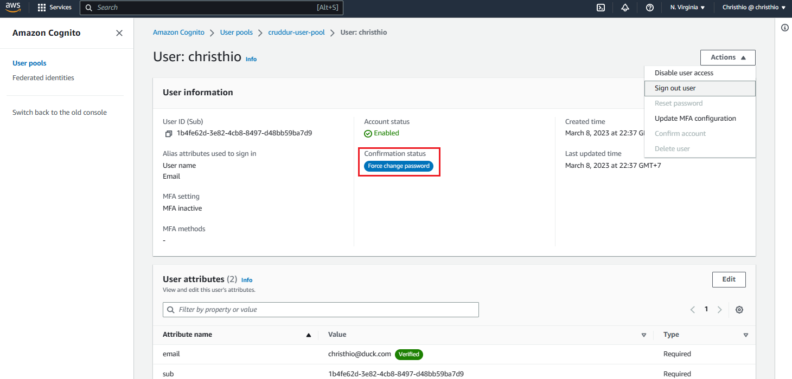

   ```sh
   aws cognito-idp admin-set-user-password \
   --user-pool-id us-east-1_nNyvfnegi \
   --username christhio \
   --password Testing123! \
   --permanent
   ```
   
   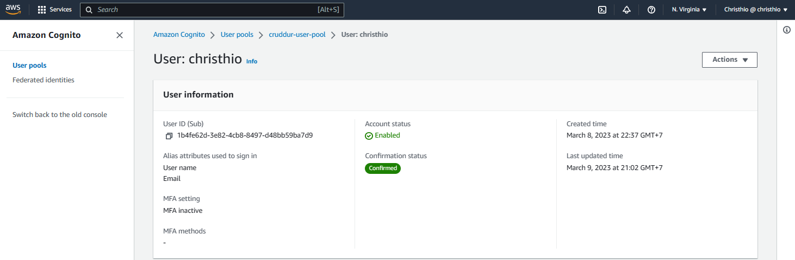
9. Run docker compose up and hit the frontend website.
10. Sign in with above credentials. The handle name and preferred name should be displayed.

    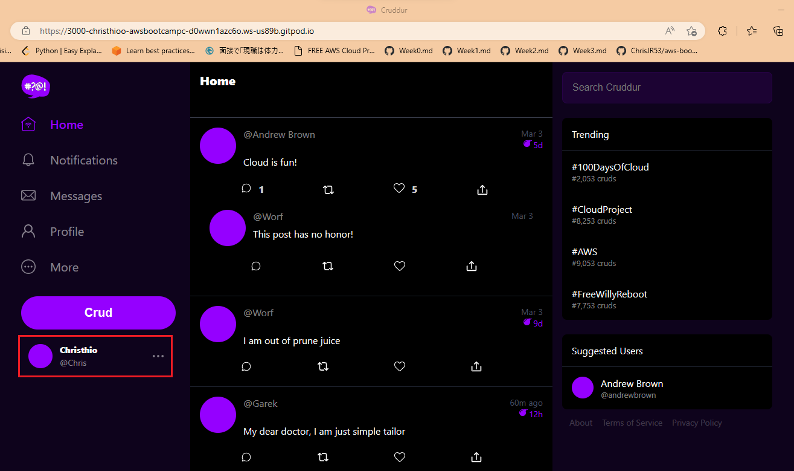

### Implement Custom Signup Page

1. Delete the user created in **Implement Custom Signin Page** section.
2. Replace `onsubmit` function with the following code in `SignupPage.js`.

   ```js
   import { Auth } from 'aws-amplify';
   
   const [errors, setErrors] = React.useState('');
   
   const onsubmit = async (event) => {
      event.preventDefault();
      setErrors('')
      try {
         const { user } = await Auth.signUp({
           username: email,
           password: password,
           attributes: {
               name: name,
               email: email,
               preferred_username: username,
           },
           autoSignIn: { // optional - enables auto sign in after user is confirmed
               enabled: true,
           }
         });
         console.log(user);
         window.location.href = `/confirm?email=${email}`
      } catch (error) {
         console.log(error);
         setErrors(error.message)
      }
      return false
   }

   let el_errors;
   if (errors){
      el_errors = <div className='errors'>{errors}</div>;
   }
   ```
3. Run docker compose up.
4. Fill in the sign up details.

   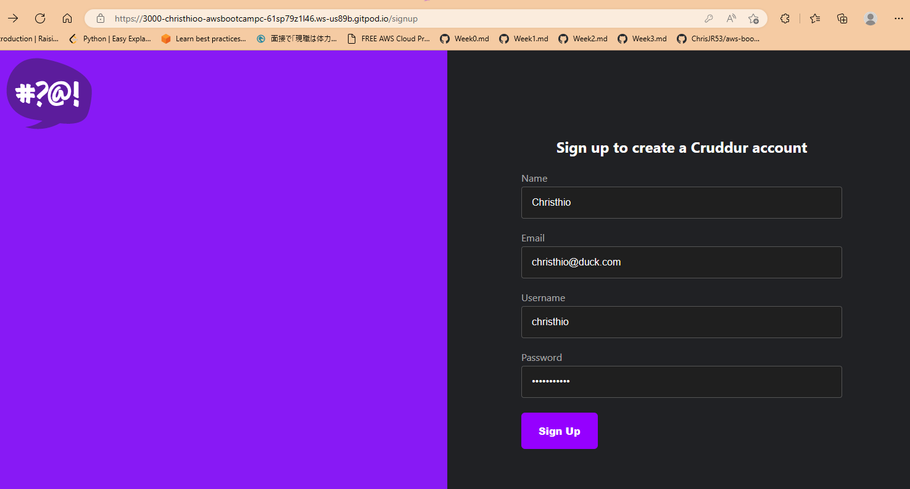
5. If it's successful, you should be redirected to confirmation page like in the screenshot below.

   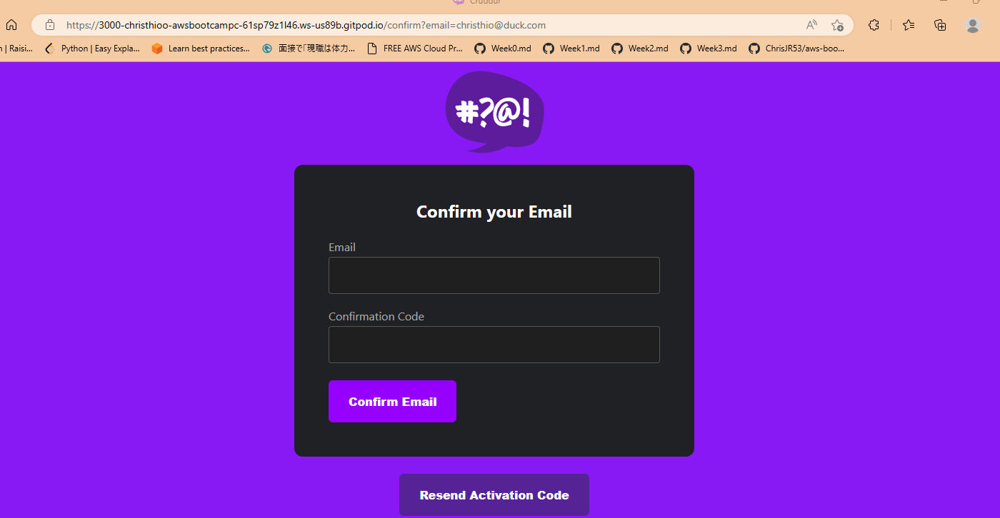

### Implement Custom Confirmation Page

1. Replace `resend_code` and `onsubmit` function with the following code in `ConfirmationPage.js`.

   ```js
   import { Auth } from 'aws-amplify';
   
   const resend_code = async (event) => {
      setErrors('')
      try {
         await Auth.resendSignUp(email);
         console.log('code resent successfully');
         setCodeSent(true)
      } catch (err) {
         // does not return a code
         // does cognito always return english
         // for this to be an okay match?
         console.log(err)
         if (err.message == 'Username cannot be empty'){
           setErrors("You need to provide an email in order to send Resend Activiation Code")   
         } else if (err.message == "Username/client id combination not found."){
           setErrors("Email is invalid or cannot be found.")   
         }
      }
   }

   const onsubmit = async (event) => {
      event.preventDefault();
      setErrors('')
      try {
         await Auth.confirmSignUp(email, code);
         window.location.href = "/"
      } catch (error) {
         setErrors(error.message)
      }
      return false
   }
   ```
2. After filling in sign up details, the confirmation form will be shown.
3. Check email and fill in the confirmation code.

   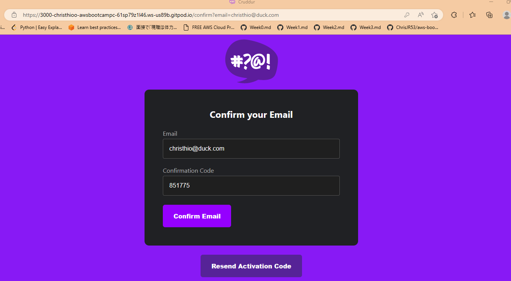
4. After successfully confirming the account, you should be redirected to homepage.

### Implement Custom Recovery Page

1. Replace `onsubmit_send_code` and `onsubmit_confirm_code` function with the following code in `RecoverPage.js`.

   ```js
   import { Auth } from 'aws-amplify';

   const onsubmit_send_code = async (event) => {
      event.preventDefault();
      setErrors('')
      Auth.forgotPassword(username)
      .then((data) => setFormState('confirm_code') )
      .catch((err) => setErrors(err.message) );
      return false
   }

   const onsubmit_confirm_code = async (event) => {
      event.preventDefault();
      setErrors('')
      if (password == passwordAgain){
         Auth.forgotPasswordSubmit(username, code, password)
         .then((data) => setFormState('success'))
         .catch((err) => setErrors(err.message) );
      } else {
          setErrors('Passwords do not match')
      }
      return false
   }
   ```
2. Run docker compose up.
3. Hit homepage and click Sign In and then Forgot Password?.
4. Fill in the email address to retrieve the reset password code.
   
   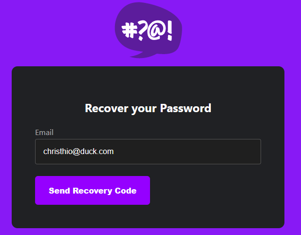
   
   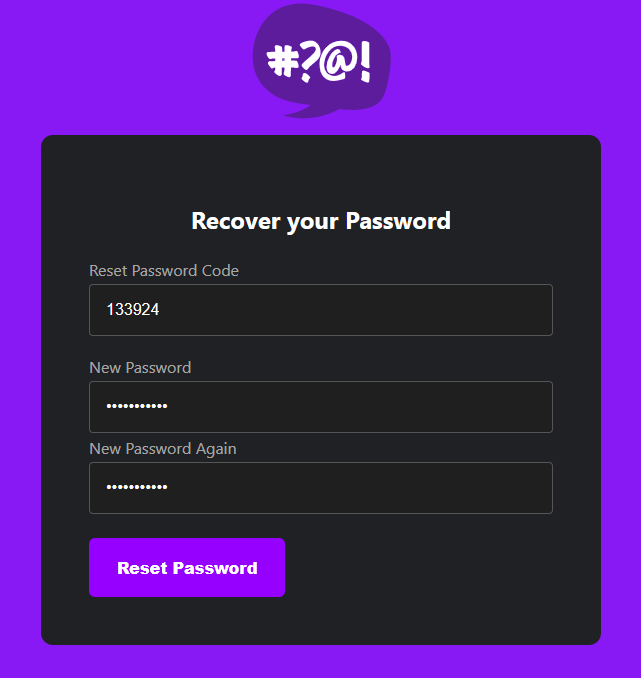
5. The final result should be "Your password has been successfully reset!".

   

### Verify JWT Token Server Side

1. Create a new file `cognito_jwt_token.py` under `backend-flask/lib`.  
   (Source: https://github.com/omenking/aws-bootcamp-cruddur-2023/blob/week-3-again/backend-flask/lib/cognito_jwt_token.py)
   
   ```py
   import time
   import requests
   from jose import jwk, jwt
   from jose.exceptions import JOSEError
   from jose.utils import base64url_decode

   class FlaskAWSCognitoError(Exception):
     pass

   class TokenVerifyError(Exception):
     pass

   def extract_access_token(request_headers):
       access_token = None
       auth_header = request_headers.get("Authorization")
       if auth_header and " " in auth_header:
           _, access_token = auth_header.split()
       return access_token

   class CognitoJwtToken:
       def __init__(self, user_pool_id, user_pool_client_id, region, request_client=None):
           self.region = region
           if not self.region:
               raise FlaskAWSCognitoError("No AWS region provided")
           self.user_pool_id = user_pool_id
           self.user_pool_client_id = user_pool_client_id
           self.claims = None
           if not request_client:
               self.request_client = requests.get
           else:
               self.request_client = request_client
           self._load_jwk_keys()


       def _load_jwk_keys(self):
           keys_url = f"https://cognito-idp.{self.region}.amazonaws.com/{self.user_pool_id}/.well-known/jwks.json"
           try:
               response = self.request_client(keys_url)
               self.jwk_keys = response.json()["keys"]
           except requests.exceptions.RequestException as e:
               raise FlaskAWSCognitoError(str(e)) from e

       @staticmethod
       def _extract_headers(token):
           try:
               headers = jwt.get_unverified_headers(token)
               return headers
           except JOSEError as e:
               raise TokenVerifyError(str(e)) from e

       def _find_pkey(self, headers):
           kid = headers["kid"]
           # search for the kid in the downloaded public keys
           key_index = -1
           for i in range(len(self.jwk_keys)):
               if kid == self.jwk_keys[i]["kid"]:
                   key_index = i
                   break
           if key_index == -1:
               raise TokenVerifyError("Public key not found in jwks.json")
           return self.jwk_keys[key_index]

       @staticmethod
       def _verify_signature(token, pkey_data):
           try:
               # construct the public key
               public_key = jwk.construct(pkey_data)
           except JOSEError as e:
               raise TokenVerifyError(str(e)) from e
           # get the last two sections of the token,
           # message and signature (encoded in base64)
           message, encoded_signature = str(token).rsplit(".", 1)
           # decode the signature
           decoded_signature = base64url_decode(encoded_signature.encode("utf-8"))
           # verify the signature
           if not public_key.verify(message.encode("utf8"), decoded_signature):
               raise TokenVerifyError("Signature verification failed")

       @staticmethod
       def _extract_claims(token):
           try:
               claims = jwt.get_unverified_claims(token)
               return claims
           except JOSEError as e:
               raise TokenVerifyError(str(e)) from e

       @staticmethod
       def _check_expiration(claims, current_time):
           if not current_time:
               current_time = time.time()
           if current_time > claims["exp"]:
               raise TokenVerifyError("Token is expired")  # probably another exception

       def _check_audience(self, claims):
           # and the Audience  (use claims['client_id'] if verifying an access token)
           audience = claims["aud"] if "aud" in claims else claims["client_id"]
           if audience != self.user_pool_client_id:
               raise TokenVerifyError("Token was not issued for this audience")

       def verify(self, token, current_time=None):
           """ https://github.com/awslabs/aws-support-tools/blob/master/Cognito/decode-verify-jwt/decode-verify-jwt.py """
           if not token:
               raise TokenVerifyError("No token provided")

           headers = self._extract_headers(token)
           pkey_data = self._find_pkey(headers)
           self._verify_signature(token, pkey_data)

           claims = self._extract_claims(token)
           self._check_expiration(claims, current_time)
           self._check_audience(claims)

           self.claims = claims 
           return claims
   ```
2. Add the following code in `app.py`.

   ```py
   from lib.cognito_jwt_token import CognitoJwtToken, extract_access_token, TokenVerifyError
   
   cognito_jwt_token = CognitoJwtToken(
      user_pool_id=os.getenv("AWS_COGNITO_USER_POOL_ID"), 
      user_pool_client_id=os.getenv("AWS_COGNITO_USER_POOL_CLIENT_ID"),
      region=os.getenv("AWS_DEFAULT_REGION")
   )
   
   cors = CORS(
      app, 
      resources={r"/api/*": {"origins": origins}},
      headers=['Content-Type', 'Authorization'], 
      expose_headers='Authorization',
      methods="OPTIONS,GET,HEAD,POST"
   )
   
   @app.route("/api/activities/home", methods=['GET'])
   def data_home():
     access_token = extract_access_token(request.headers)
     try:
       claims = cognito_jwt_token.verify(access_token)
       # authenticated request
       app.logger.debug("authenticated")
       app.logger.debug(claims)
       app.logger.debug(claims['username'])
       data = HomeActivities.run(cognito_user_id=claims['username'])
     except TokenVerifyError as e:
       # unauthenicatied request
       app.logger.debug(e)
       app.logger.debug("unauthenticated")
       data = HomeActivities.run()
     return data, 200
   ```
3. Add environment variables to `backend-flask` in `docker-compose.yml`.

   ```yml
   AWS_COGNITO_USER_POOL_ID: "us-east-1_a2tfqcMqC"
   AWS_COGNITO_USER_POOL_CLIENT_ID: "7bod92bmc67m5fk5epkgjiphi5"    
   ```
4. Add in the `HomeFeedPage.js` a header to pass along the access token.
   
   ```js
   const res = await fetch(backend_url, {
      headers: {
         Authorization: `Bearer ${localStorage.getItem("access_token")}`
      },
      method: "GET"
   });
   ```
5. Add `python-jose` into `requirements.txt`.

   ```txt
   python-jose
   ```
6. Run pip install.
   
   ```sh
   pip install -r requirements.txt
   ```
7. To verify whether jwt token is working, modify the `home_activities.py`.

   ```py
   def run(cognito_user_id=None):
      if cognito_user_id != None:
        extra_crud = {
          'uuid': '248959df-3079-4947-b847-9e0892d1bab4',
          'handle':  'Chris',
          'message': 'My dear sister, hope to see you again next time',
          'created_at': (now - timedelta(hours=1)).isoformat(),
          'expires_at': (now + timedelta(hours=12)).isoformat(),
          'likes': 997,
          'replies': []
        }
        results.insert(0,extra_crud)
        
      return results        
   ```
8. Edit signout function to delete jwt-token in `ProfileInfo.js`.

   ```js
   const signOut = async () => {
      try {
        await Auth.signOut({ global: true });
        window.location.href = "/"
        localStorage.removeItem("access_token")
      } catch (error) {
        console.log('error signing out: ', error);
      }
   }
   ```
9. Run docker compose up and hit the homepage.
10. Sign in and refresh the page, the extra message should be displayed.

    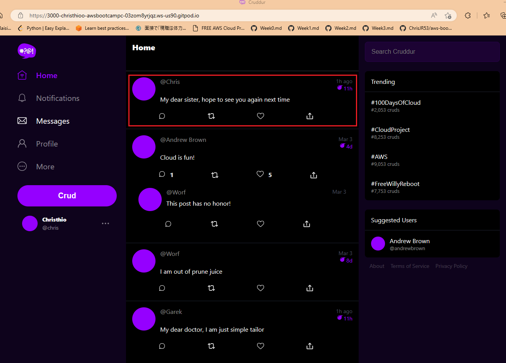
11. Sign out and the extra message should disappear.

    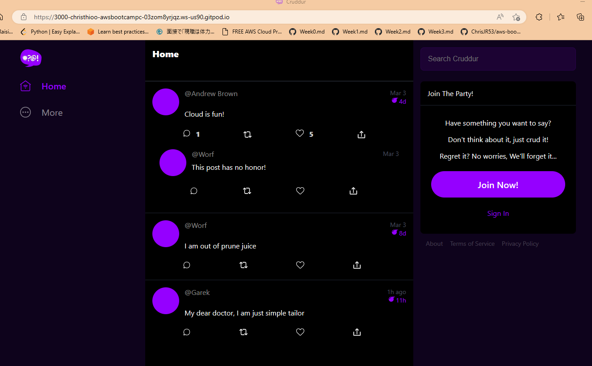

## Homework Challenges

### Decouple the JWT verify from the application code by writing a Flask Middleware

1. This is to decouple the code from [Verify JWT Token Server Side](#verify-jwt-token-server-side).
2. Create a middleware file under `middlewares/jwt.py`.

   ```py
   from werkzeug.wrappers import Request
   from flask import request
   from lib.cognito_jwt_token import CognitoJwtToken, extract_access_token, TokenVerifyError
   import os

   class JWTMiddleware:
      def __init__(self, app):
         self.app = app
         self.cognito_jwt_token = CognitoJwtToken(
            user_pool_id=os.getenv("AWS_COGNITO_USER_POOL_ID"), 
            user_pool_client_id=os.getenv("AWS_COGNITO_USER_POOL_CLIENT_ID"),
            region=os.getenv("AWS_DEFAULT_REGION")
         )

      def __call__(self, environ, start_response):
         request = Request(environ)
         try:
            access_token = extract_access_token(request.headers)			
            claims = self.cognito_jwt_token.verify(access_token)			
         except TokenVerifyError:
            self.cognito_jwt_token.claims = {'username': None}

         return self.app(environ, start_response)
   ```
3. Add new line in `requirements.txt` file.

   ```
   werkzeug
   ```
4. Run pip install

   ```
   pip install -r requirements.txt
   ```
5. Add the following codes in `app.py`.

   ```diff
   - from lib.cognito_jwt_token import CognitoJwtToken, extract_access_token, TokenVerifyError
   + from middlewares.jwt import JWTMiddleware

   - cognito_jwt_token = CognitoJwtToken(
   -   user_pool_id=os.getenv("AWS_COGNITO_USER_POOL_ID"), 
   -   user_pool_client_id=os.getenv("AWS_COGNITO_USER_POOL_CLIENT_ID"),
   -   region=os.getenv("AWS_DEFAULT_REGION")
   - )

   + app.wsgi_app = JWTMiddleware(app.wsgi_app)
   + jwt_middleware = app.wsgi_app

   @app.route("/api/activities/home", methods=['GET'])
   def data_home():
   - access_token = extract_access_token(request.headers)
   - try:
   -   claims = cognito_jwt_token.verify(access_token)
   -   data = HomeActivities.run(cognito_user_id=claims['username'])
   - except TokenVerifyError as e:
   -   data = HomeActivities.run()
   + username = jwt_middleware.cognito_jwt_token.claims['username']
   + data = HomeActivities.run(cognito_user_id=username)
   return data, 200
   ```
6. Run docker compose up and hit the homepage.
7. Sign in and refresh the page, the extra message should be displayed.
   
   
8. Sign out and the extra message should disappear.

   
