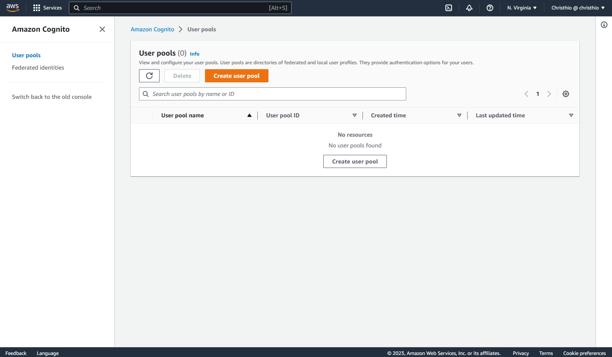
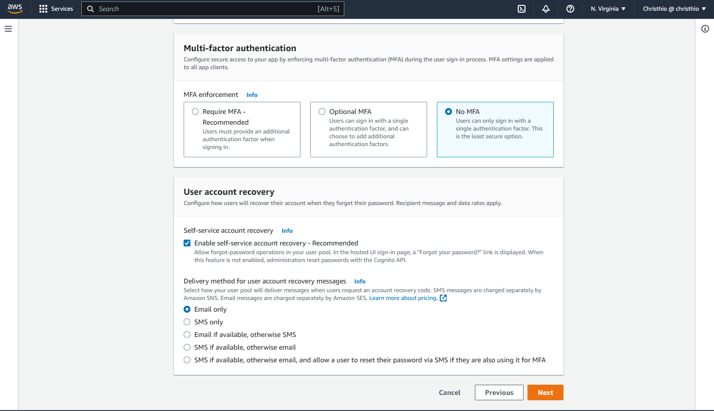
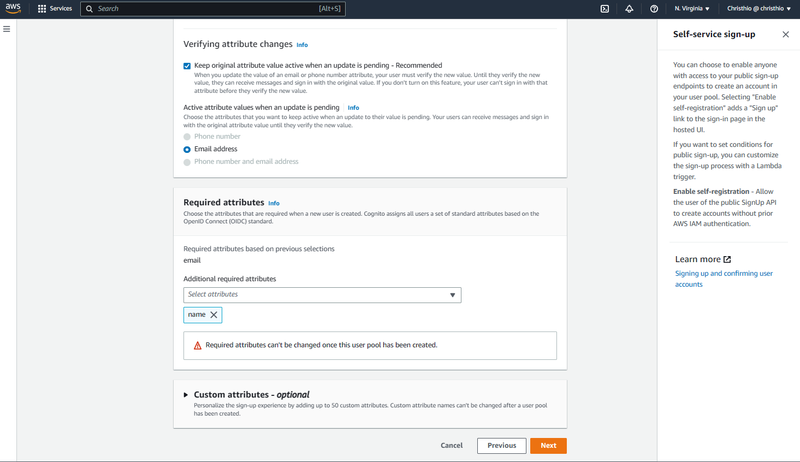

# Week 3 — Decentralized Authentication

## Required Homework/Tasks

### Setup Cognito User Pool

1. Navigate to AWS Cognito > User pools.

   
2. Create user pool.
3. For sign-in experience configuration step, follow the screenshot below.

   
4. For security requirements configuration step, follow the screenshots below.
   For this bootcamp, 8 characters password length is sufficient.
   In addition, we use e-mail as a user account recovery method instead of SMS as we don't want incur extra cost for the bootcamp.

   
   
   
5. For sign-up experience configuration step, follow the screenshots below.

   
   
   
6. For message delivery configuration step, follow the screenshot below.

   
7. For integrate your app step, follow the screenshots below.

   
   
   
8. Review the configuration and click 'Create user pool'.

   

### Implement Custom Signin Page

### Implement Custom Signup Page

### Implement Custom Confirmation Page

### Implement Custom Recovery Page

### Watch about different approaches to verifying JWTs
