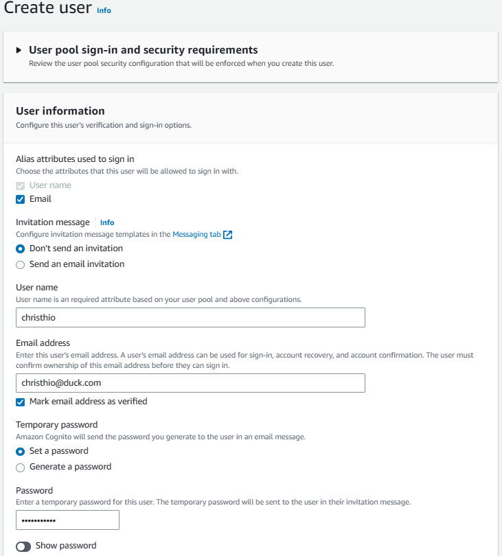

# Week 3 — Decentralized Authentication

## Required Homework/Tasks

### Setup Cognito User Pool

1. Navigate to AWS Cognito > User pools.

   
2. Create user pool.
3. For sign-in experience configuration step, follow the screenshot below.

   
4. For security requirements configuration step, follow the screenshots below.
   For this bootcamp, 8 characters password length is sufficient.
   In addition, we use e-mail as a user account recovery method instead of SMS as we don't want incur extra cost for the bootcamp.

   
   
   
5. For sign-up experience configuration step, follow the screenshots below.

   
   
   
6. For message delivery configuration step, follow the screenshot below.

   
7. For integrate your app step, follow the screenshots below.

   
   
   
8. Review the configuration and click 'Create user pool'.

   

### Implement Custom Signin Page

1. Install AWS Amplify.
   
   ```sh
   npm i aws-amplify --save
   ```
2. Add environment variables to `frontend-react-js's environment` in `docker-compose.yml`.

   ```yml
   REACT_APP_AWS_PROJECT_REGION: "${AWS_DEFAULT_REGION}"
   REACT_APP_AWS_COGNITO_REGION: "${AWS_DEFAULT_REGION}"
   REACT_APP_AWS_USER_POOLS_ID: "us-east-1_nNyvfnegi"
   REACT_APP_CLIENT_ID: "5mhavv9qbf2k41d1fc15ge4587"
   ```
   Note that REACT_APP_AWS_USER_POOLS_ID can be found user pools table list, while REACT_APP_CLIENT_ID can be found inside user pool's App Integration.
   
   
   
   
3. Configure AWS Amplify in `App.js` under frontend-react-js.

   ```js
   import { Amplify } from 'aws-amplify';

   Amplify.configure({
     "AWS_PROJECT_REGION": process.env.REACT_APP_AWS_PROJECT_REGION,
     "aws_cognito_region": process.env.REACT_APP_AWS_COGNITO_REGION,
     "aws_user_pools_id": process.env.REACT_APP_AWS_USER_POOLS_ID,
     "aws_user_pools_web_client_id": process.env.REACT_APP_CLIENT_ID,
     "oauth": {},
     Auth: {
       // We are not using an Identity Pool
       // identityPoolId: process.env.REACT_APP_IDENTITY_POOL_ID, // REQUIRED - Amazon Cognito Identity Pool ID
       region: process.env.REACT_APP_AWS_PROJECT_REGION,           // REQUIRED - Amazon Cognito Region
       userPoolId: process.env.REACT_APP_AWS_USER_POOLS_ID,         // OPTIONAL - Amazon Cognito User Pool ID
       userPoolWebClientId: process.env.REACT_APP_CLIENT_ID,   // OPTIONAL - Amazon Cognito Web Client ID (26-char alphanumeric string)
     }
   });
   ```
4. Set whether we are authenticated when we load page by replacing the existing code with the following code in `HomeFeedPage.js`.

   ```js
   import { Auth } from 'aws-amplify';

   // set a state
   const [user, setUser] = React.useState(null);

   // check if we are authenicated
   const checkAuth = async () => {
     Auth.currentAuthenticatedUser({
       // Optional, By default is false. 
       // If set to true, this call will send a 
       // request to Cognito to get the latest user data
       bypassCache: false 
     })
     .then((user) => {
       console.log('user',user);
       return Auth.currentAuthenticatedUser()
     }).then((cognito_user) => {
         setUser({
           display_name: cognito_user.attributes.name,
           handle: cognito_user.attributes.preferred_username
         })
     })
     .catch((err) => console.log(err));
   };

   // check when the page loads if we are authenicated
   React.useEffect(()=>{
     //prevents double call
     if (dataFetchedRef.current) return;
     dataFetchedRef.current = true;
     
     loadData();
     checkAuth();
   }, [])
   ```
5. Replace the function of `signOut` to the following code in `ProfileInfo.js`.

   ```js
   import { Auth } from 'aws-amplify';

   const signOut = async () => {
     try {
         await Auth.signOut({ global: true });
         window.location.href = "/"
     } catch (error) {
         console.log('error signing out: ', error);
     }
   }
   ```
6. Replace the function of `onsubmit` to the following code in `SigninPage.js`.

   ```js
   import { Auth } from 'aws-amplify';
   
   const [errors, setErrors] = React.useState('');

   const onsubmit = async (event) => {
     setErrors('')
     event.preventDefault();
     Auth.signIn(email, password)
      .then(user => {
        localStorage.setItem("access_token", user.signInUserSession.accessToken.jwtToken)
        window.location.href = "/"
      })
     .catch(error => {
       if (error.code == 'UserNotConfirmedException') {
         window.location.href = "/confirm"
       }
       setErrors(error.message)
     });
     return false
   }

   let el_errors;
   if (errors){
      el_errors = <div className='errors'>{errors}</div>;
   }
   ```
7. Create a user from the user pool on AWS Console.

   
   
   

### Implement Custom Signup Page

### Implement Custom Confirmation Page

### Implement Custom Recovery Page

### Watch about different approaches to verifying JWTs
