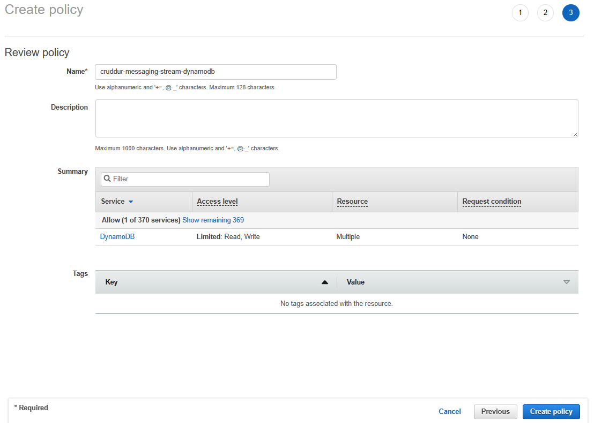
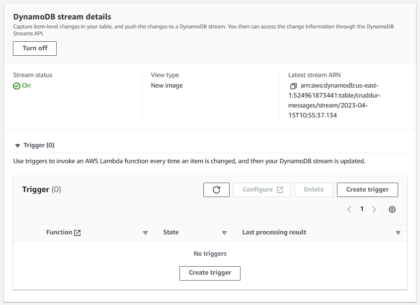

# Week 5 — DynamoDB and Serverless Caching

[Required Homework/Tasks](#required-homeworktasks)
- [Implement Schema Load Script](#implement-schema-load-script)
- [Implement Seed Script](#implement-seed-script)
- [Implement Scan Script](#implement-scan-script)
- [Implement Drop Table Script](#implement-drop-table-script)
- [Implement Pattern Scripts for Read and List Conversations](#implement-pattern-scripts-for-read-and-list-conversations)
- [Implement Update Cognito ID Script for Postgres Database](#implement-update-cognito-id-script-for-postgres-database)
- [Implement (Pattern A) Listing Messages in Message Group into Application](#implement-pattern-a-listing-messages-in-message-group-into-application)
- [Implement (Pattern B) Listing Messages Group into Application](#implement-pattern-b-listing-messages-group-into-application)
- [Implement (Pattern C) Creating a Message for an existing Message Group into Application](#implement-pattern-c-creating-a-message-for-an-existing-message-group-into-application)
- [Implement (Pattern D) Creating a Message for a new Message Group into Application](#implement-pattern-d-creating-a-message-for-a-new-message-group-into-application)
- [Implement (Pattern E) Updating a Message Group using DynamoDB Streams](#implement-pattern-e-updating-a-message-group-using-dynamodb-streams)

## Required Homework/Tasks

### Implement Schema Load Script
1. Create a new script file `bin/ddb/schema-load` under `backend-flask` directory.

    ```py
    #!/usr/bin/env python3

    import boto3
    import sys

    attrs = {
      'endpoint_url': 'http://localhost:8000'
    }

    if len(sys.argv) == 2:
      if "prod" in sys.argv[1]:
        attrs = {}

    ddb = boto3.client('dynamodb',**attrs)

    table_name = 'cruddur-messages'


    response = ddb.create_table(
      TableName=table_name,
      AttributeDefinitions=[
        {
          'AttributeName': 'message_group_uuid',
          'AttributeType': 'S'
        },
        {
          'AttributeName': 'pk',
          'AttributeType': 'S'
        },
        {
          'AttributeName': 'sk',
          'AttributeType': 'S'
        },
      ],
      KeySchema=[
        {
          'AttributeName': 'pk',
          'KeyType': 'HASH'
        },
        {
          'AttributeName': 'sk',
          'KeyType': 'RANGE'
        },
      ],
      GlobalSecondaryIndexes= [{
        'IndexName':'message-group-sk-index',
        'KeySchema':[{
          'AttributeName': 'message_group_uuid',
          'KeyType': 'HASH'
        },{
          'AttributeName': 'sk',
          'KeyType': 'RANGE'
        }],
        'Projection': {
          'ProjectionType': 'ALL'
        },
        'ProvisionedThroughput': {
          'ReadCapacityUnits': 5,
          'WriteCapacityUnits': 5
        },
      }],
      BillingMode='PROVISIONED',
      ProvisionedThroughput={
          'ReadCapacityUnits': 5,
          'WriteCapacityUnits': 5
      }
    )

    print(response)
    ```
2. Make the python script executable.

    ```sh
    chmod u+x bin/ddb/schema-load
    ```
3. Add boto3 into `requirements.txt`.

    ```sh
    boto3
    ```
4. Run pip install.

    ```sh
    pip install -r requirements.txt
    ```
5. Execute the script (run from `/backend-flask` directory).

    ```sh
    ./bin/ddb/schema-load
    ```
    
    

### Implement Seed Script
1. Create a new script file `bin/ddb/seed` under `backend-flask` directory.

   ```py
    #!/usr/bin/env python3

    import boto3
    import os
    import sys
    from datetime import datetime, timedelta, timezone
    import uuid

    current_path = os.path.dirname(os.path.abspath(__file__))
    parent_path = os.path.abspath(os.path.join(current_path, '..', '..'))
    sys.path.append(parent_path)
    from lib.db import db

    attrs = {
      'endpoint_url': 'http://localhost:8000'
    }
    # unset endpoint url for use with production database
    if len(sys.argv) == 2:
      if "prod" in sys.argv[1]:
        attrs = {}
    ddb = boto3.client('dynamodb',**attrs)

    def get_user_uuids():
      sql = """
        SELECT 
          users.uuid,
          users.display_name,
          users.handle
        FROM users
        WHERE
          users.handle IN(
            %(my_handle)s,
            %(other_handle)s
            )
      """
      users = db.query_array_json(sql,{
        'my_handle':  'christhio',
        'other_handle': 'bayko'
      })
      my_user    = next((item for item in users if item["handle"] == 'christhio'), None)
      other_user = next((item for item in users if item["handle"] == 'bayko'), None)
      results = {
        'my_user': my_user,
        'other_user': other_user
      }
      print('get_user_uuids')
      print(results)
      return results

    def create_message_group(client,message_group_uuid, my_user_uuid, last_message_at=None, message=None, other_user_uuid=None, other_user_display_name=None, other_user_handle=None):
      table_name = 'cruddur-messages'
      record = {
        'pk':   {'S': f"GRP#{my_user_uuid}"},
        'sk':   {'S': last_message_at},
        'message_group_uuid': {'S': message_group_uuid},
        'message':  {'S': message},
        'user_uuid': {'S': other_user_uuid},
        'user_display_name': {'S': other_user_display_name},
        'user_handle': {'S': other_user_handle}
      }

      response = client.put_item(
        TableName=table_name,
        Item=record
      )
      print(response)

    def create_message(client,message_group_uuid, created_at, message, my_user_uuid, my_user_display_name, my_user_handle):
      table_name = 'cruddur-messages'
      record = {
        'pk':   {'S': f"MSG#{message_group_uuid}"},
        'sk':   {'S': created_at },
        'message_uuid': { 'S': str(uuid.uuid4()) },
        'message': {'S': message},
        'user_uuid': {'S': my_user_uuid},
        'user_display_name': {'S': my_user_display_name},
        'user_handle': {'S': my_user_handle}
      }
      # insert the record into the table
      response = client.put_item(
        TableName=table_name,
        Item=record
      )
      # print the response
      print(response)

    message_group_uuid = "5ae290ed-55d1-47a0-bc6d-fe2bc2700399" 
    now = datetime.now(timezone.utc).astimezone()
    users = get_user_uuids()

    create_message_group(
      client=ddb,
      message_group_uuid=message_group_uuid,
      my_user_uuid=users['my_user']['uuid'],
      other_user_uuid=users['other_user']['uuid'],
      other_user_handle=users['other_user']['handle'],
      other_user_display_name=users['other_user']['display_name'],
      last_message_at=now.isoformat(),
      message="this is a filler message"
    )

    create_message_group(
      client=ddb,
      message_group_uuid=message_group_uuid,
      my_user_uuid=users['other_user']['uuid'],
      other_user_uuid=users['my_user']['uuid'],
      other_user_handle=users['my_user']['handle'],
      other_user_display_name=users['my_user']['display_name'],
      last_message_at=now.isoformat(),
      message="this is a filler message"
    )

    conversation = """
    Person 1: Have you ever watched Babylon 5? It's one of my favorite TV shows!
    Person 2: Yes, I have! I love it too. What's your favorite season?
    Person 1: I think my favorite season has to be season 3. So many great episodes, like "Severed Dreams" and "War Without End."
    Person 2: Yeah, season 3 was amazing! I also loved season 4, especially with the Shadow War heating up and the introduction of the White Star.
    Person 1: Agreed, season 4 was really great as well. I was so glad they got to wrap up the storylines with the Shadows and the Vorlons in that season.
    Person 2: Definitely. What about your favorite character? Mine is probably Londo Mollari.
    Person 1: Londo is great! My favorite character is probably G'Kar. I loved his character development throughout the series.
    Person 2: G'Kar was definitely a standout character. I also really liked Delenn's character arc and how she grew throughout the series.
    Person 1: Delenn was amazing too, especially with her role in the Minbari Civil War and her relationship with Sheridan. Speaking of which, what did you think of the Sheridan character?
    Person 2: I thought Sheridan was a great protagonist. He was a strong leader and had a lot of integrity. And his relationship with Delenn was so well-done.
    Person 1: I totally agree! I also really liked the dynamic between Garibaldi and Bester. Those two had some great scenes together.
    Person 2: Yes! Their interactions were always so intense and intriguing. And speaking of intense scenes, what did you think of the episode "Intersections in Real Time"?
    Person 1: Oh man, that episode was intense. It was so well-done, but I could barely watch it. It was just too much.
    Person 2: Yeah, it was definitely hard to watch. But it was also one of the best episodes of the series in my opinion.
    Person 1: Absolutely. Babylon 5 had so many great episodes like that. Do you have a favorite standalone episode?
    Person 2: Hmm, that's a tough one. I really loved "The Coming of Shadows" in season 2, but "A Voice in the Wilderness" in season 1 was also great. What about you?
    Person 1: I think my favorite standalone episode might be "The Long Twilight Struggle" in season 2. It had some great moments with G'Kar and Londo.
    Person 2: Yes, "The Long Twilight Struggle" was definitely a standout episode. Babylon 5 really had so many great episodes and moments throughout its run.
    Person 1: Definitely. It's a shame it ended after only five seasons, but I'm glad we got the closure we did with the series finale.
    Person 2: Yeah, the series finale was really well-done. It tied up a lot of loose ends and left us with a great sense of closure.
    Person 1: It really did. Overall, Babylon 5 is just such a great show with fantastic characters, writing, and world-building.
    Person 2: Agreed. It's one of my favorite sci-fi shows of all time and I'm always happy to revisit it.
    Person 1: Same here. I think one of the things that makes Babylon 5 so special is its emphasis on politics and diplomacy. It's not just a show about space battles and aliens, but about the complex relationships between different species and their political maneuvering.
    Person 2: Yes, that's definitely one of the show's strengths. And it's not just about big-picture politics, but also about personal relationships and the choices characters make.
    Person 1: Exactly. I love how Babylon 5 explores themes of redemption, forgiveness, and sacrifice. Characters like G'Kar and Londo have such compelling arcs that are driven by their choices and actions.
    Person 2: Yes, the character development in Babylon 5 is really top-notch. Even minor characters like Vir and Franklin get their moments to shine and grow over the course of the series.
    Person 1: I couldn't agree more. And the way the show handles its themes is so nuanced and thought-provoking. For example, the idea of "the one" and how it's used by different characters in different ways.
    Person 2: Yes, that's a really interesting theme to explore. And it's not just a one-dimensional concept, but something that's explored in different contexts and with different characters.
    Person 1: And the show also does a great job of balancing humor and drama. There are so many funny moments in the show, but it never detracts from the serious themes and the high stakes.
    Person 2: Absolutely. The humor is always organic and never feels forced. And the show isn't afraid to go dark when it needs to, like in "Intersections in Real Time" or the episode "Sleeping in Light."
    Person 1: Yeah, those episodes are definitely tough to watch, but they're also some of the most powerful and memorable episodes of the series. And it's not just the writing that's great, but also the acting and the production values.
    Person 2: Yes, the acting is fantastic across the board. From Bruce Boxleitner's performance as Sheridan to Peter Jurasik's portrayal of Londo, every actor brings their A-game. And the production design and special effects are really impressive for a TV show from the 90s.
    Person 1: Definitely. Babylon 5 was really ahead of its time in terms of its visuals and special effects. And the fact that it was all done on a TV budget makes it even more impressive.
    Person 2: Yeah, it's amazing what they were able to accomplish with the limited resources they had. It just goes to show how talented the people behind the show were.
    Person 1: Agreed. It's no wonder that Babylon 5 has such a devoted fanbase, even all these years later. It's just such a well-crafted and timeless show.
    Person 2: Absolutely. I'm glad we can still appreciate it and talk about it all these years later. It really is a show that stands the test of time.
    Person 1: One thing I really appreciate about Babylon 5 is how it handles diversity and representation. It has a really diverse cast of characters from different species and backgrounds, and it doesn't shy away from exploring issues of prejudice and discrimination.
    Person 2: Yes, that's a great point. The show was really ahead of its time in terms of its diverse cast and the way it tackled issues of race, gender, and sexuality. And it did so in a way that felt natural and integrated into the story.
    Person 1: Definitely. It's great to see a show that's not afraid to tackle these issues head-on and address them in a thoughtful and nuanced way. And it's not just about representation, but also about exploring different cultures and ways of life.
    Person 2: Yes, the show does a great job of world-building and creating distinct cultures for each of the species. And it's not just about their physical appearance, but also about their customs, beliefs, and values.
    Person 1: Absolutely. It's one of the things that sets Babylon 5 apart from other sci-fi shows. The attention to detail and the thought that went into creating this universe is really impressive.
    Person 2: And it's not just the aliens that are well-developed, but also the human characters. The show explores the different factions and political ideologies within EarthGov, as well as the different cultures and traditions on Earth.
    Person 1: Yes, that's another great aspect of the show. It's not just about the conflicts between different species, but also about the internal struggles within humanity. And it's all tied together by the overarching plot of the Shadow War and the fate of the galaxy.
    Person 2: Definitely. The show does a great job of balancing the episodic stories with the larger arc, so that every episode feels important and contributes to the overall narrative.
    Person 1: And the show is also great at building up tension and suspense. The slow burn of the Shadow War and the mystery of the Vorlons and the Shadows kept me on the edge of my seat throughout the series.
    Person 2: Yes, the show is really good at building up anticipation and delivering satisfying payoffs. Whether it's the resolution of a character arc or the climax of a season-long plotline, Babylon 5 always delivers.
    Person 1: Agreed. It's just such a well-crafted and satisfying show, with so many memorable moments and characters. I'm really glad we got to talk about it today.
    Person 2: Me too. It's always great to geek out about Babylon 5 with someone who appreciates it as much as I do!
    Person 1: Yeah, it's always fun to discuss our favorite moments and characters from the show. And there are so many great moments to choose from!
    Person 2: Definitely. I think one of the most memorable moments for me was the "goodbye" scene between G'Kar and Londo in the episode "Objects at Rest." It was such a poignant and emotional moment, and it really showed how far their characters had come.
    Person 1: Yes, that was a really powerful scene. It was great to see these two former enemies come together and find common ground. And it was a great way to wrap up their character arcs.
    Person 2: Another memorable moment for me was the speech that Sheridan gives in "Severed Dreams." It's such an iconic moment in the show, and it really encapsulates the themes of the series.
    Person 1: Yes, that speech is definitely one of the highlights of the series. It's so well-written and well-delivered, and it really captures the sense of hope and defiance that the show is all about.
    Person 2: And speaking of great speeches, what did you think of the "Ivanova is always right" speech from "Moments of Transition"?
    Person 1: Oh man, that speech gives me chills every time I watch it. It's such a powerful moment for Ivanova, and it really shows her strength and determination as a leader.
    Person 2: Yes, that speech is definitely a standout moment for Ivanova's character. And it's just one example of the great writing and character development in the show.
    Person 1: Absolutely. It's a testament to the talent of the writers and actors that they were able to create such rich and complex characters with so much depth and nuance.
    Person 2: And it's not just the main characters that are well-developed, but also the supporting characters like Marcus, Zack, and Lyta. They all have their own stories and struggles, and they all contribute to the larger narrative in meaningful ways.
    Person 1: Definitely. Babylon 5 is just such a well-rounded and satisfying show in every way. It's no wonder that it's still beloved by fans all these years later.
    Person 2: Agreed. It's a show that has stood the test of time, and it will always hold a special place in my heart as one of my favorite TV shows of all time.
    Person 1: One of the most interesting ethical dilemmas presented in Babylon 5 is the treatment of the Narn by the Centauri. What do you think about that storyline?
    Person 2: Yeah, it's definitely a difficult issue to grapple with. On the one hand, the Centauri were portrayed as the aggressors, and their treatment of the Narn was brutal and unjust. But on the other hand, the show also presented some nuance to the situation, with characters like Londo and Vir struggling with their own complicity in the conflict.
    Person 1: Exactly. I think one of the strengths of the show is its willingness to explore complex ethical issues like this. It's not just about good guys versus bad guys, but about the shades of grey in between.
    Person 2: Yeah, and it raises interesting questions about power and oppression. The Centauri had more advanced technology and military might than the Narn, which allowed them to dominate and subjugate the Narn people. But at the same time, there were also political and economic factors at play that contributed to the conflict.
    Person 1: And it's not just about the actions of the Centauri government, but also about the actions of individual characters. Londo, for example, was initially portrayed as a somewhat sympathetic character, but as the series progressed, we saw how his choices and actions contributed to the suffering of the Narn people.
    Person 2: Yes, and that raises interesting questions about personal responsibility and accountability. Can an individual be held responsible for the actions of their government or their society? And if so, to what extent?
    Person 1: That's a really good point. And it's also interesting to consider the role of empathy and compassion in situations like this. Characters like G'Kar and Delenn showed compassion towards the Narn people and fought against their oppression, while others like Londo and Cartagia were more indifferent or even sadistic in their treatment of the Narn.
    Person 2: Yeah, and that raises the question of whether empathy and compassion are innate traits, or whether they can be cultivated through education and exposure to different cultures and perspectives.
    Person 1: Definitely. And it's also worth considering the role of forgiveness and reconciliation. The Narn and Centauri eventually came to a sort of reconciliation in the aftermath of the Shadow War, but it was a difficult and painful process that required a lot of sacrifice and forgiveness on both sides.
    Person 2: Yes, and that raises the question of whether forgiveness is always possible or appropriate in situations of oppression and injustice. Can the victims of such oppression ever truly forgive their oppressors, or is that too much to ask?
    Person 1: It's a tough question to answer. I think the show presents a hopeful message in the end, with characters like G'Kar and Londo finding a measure of redemption and reconciliation. But it's also clear that the scars of the conflict run deep and that healing takes time and effort.
    Person 2: Yeah, that's a good point. Ultimately, I think the show's treatment of the Narn-Centauri conflict raises more questions than it answers, which is a testament to its complexity and nuance. It's a difficult issue to grapple with, but one that's worth exploring and discussing.
    Person 1: Let's switch gears a bit and talk about the character of Natasha Alexander. What did you think about her role in the series?
    Person 2: I thought Natasha Alexander was a really interesting character. She was a tough and competent security officer, but she also had a vulnerable side and a complicated past.
    Person 1: Yeah, I agree. I think she added a lot of depth to the show and was a great foil to characters like Garibaldi and Zack.
    Person 2: And I also appreciated the way the show handled her relationship with Garibaldi. It was clear that they had a history and a lot of unresolved tension, but the show never made it too melodramatic or over-the-top.
    Person 1: That's a good point. I think the show did a good job of balancing the personal drama with the larger political and sci-fi elements. And it was refreshing to see a female character who was just as tough and competent as the male characters.
    Person 2: Definitely. I think Natasha Alexander was a great example of a well-written and well-rounded female character. She wasn't just there to be eye candy or a love interest, but had her own story and agency.
    Person 1: However, I did feel like the show could have done more with her character. She was introduced fairly late in the series, and didn't have as much screen time as some of the other characters.
    Person 2: That's true. I think the show had a lot of characters to juggle, and sometimes that meant some characters got sidelined or didn't get as much development as they deserved.
    Person 1: And I also thought that her storyline with Garibaldi could have been developed a bit more. They had a lot of history and tension between them, but it felt like it was resolved too quickly and neatly.
    Person 2: I can see where you're coming from, but I also appreciated the way the show didn't drag out the drama unnecessarily. It was clear that they both had feelings for each other, but they also had to focus on their jobs and the larger conflicts at play.
    Person 1: I can see that perspective as well. Overall, I think Natasha Alexander was a great addition to the show and added a lot of value to the series. It's a shame we didn't get to see more of her.
    Person 2: Agreed. But at least the show was able to give her a satisfying arc and resolution in the end. And that's a testament to the show's strength as a whole.
    Person 1: One thing that really stands out about Babylon 5 is the quality of the special effects. What did you think about the show's use of CGI and other visual effects?
    Person 2: I thought the special effects in Babylon 5 were really impressive, especially for a show that aired in the 90s. The use of CGI to create the spaceships and other sci-fi elements was really innovative for its time.
    Person 1: Yes, I was really blown away by the level of detail and realism in the effects. The ships looked so sleek and futuristic, and the space battles were really intense and exciting.
    Person 2: And I also appreciated the way the show integrated the visual effects with the live-action footage. It never felt like the effects were taking over or overshadowing the characters or the story.
    Person 1: Absolutely. The show had a great balance of practical effects and CGI, which helped to ground the sci-fi elements in a more tangible and realistic world.
    Person 2: And it's also worth noting the way the show's use of visual effects evolved over the course of the series. The effects in the first season were a bit rough around the edges, but by the end of the series, they had really refined and perfected the look and feel of the show.
    Person 1: Yes, I agree. And it's impressive how they were able to accomplish all of this on a TV budget. The fact that the show was able to create such a rich and immersive sci-fi universe with limited resources is a testament to the talent and creativity of the production team.
    Person 2: Definitely. And it's one of the reasons why the show has aged so well. Even today, the visual effects still hold up and look impressive, which is a rarity for a show that's almost 30 years old.
    Person 1: Agreed. And it's also worth noting the way the show's use of visual effects influenced other sci-fi shows that came after it. Babylon 5 really set the bar for what was possible in terms of sci-fi visuals on TV.
    Person 2: Yes, it definitely had a big impact on the genre as a whole. And it's a great example of how innovative and groundbreaking sci-fi can be when it's done right.
    Person 1: Another character I wanted to discuss is Zathras. What did you think of his character?
    Person 2: Zathras was a really unique and memorable character. He was quirky and eccentric, but also had a lot of heart and sincerity.
    Person 1: Yes, I thought he was a great addition to the show. He added some much-needed comic relief, but also had some important moments of character development.
    Person 2: And I appreciated the way the show used him as a sort of plot device, with his knowledge of time and space being instrumental in the resolution of some of the show's major storylines.
    Person 1: Definitely. It was a great way to integrate a seemingly minor character into the larger narrative. And it was also interesting to see the different versions of Zathras from different points in time.
    Person 2: Yeah, that was a clever storytelling device that really added to the sci-fi elements of the show. And it was also a great showcase for actor Tim Choate, who played the character with so much charm and energy.
    Person 1: I also thought that Zathras was a great example of the show's commitment to creating memorable and unique characters. Even characters that only appeared in a few episodes, like Zathras or Bester, were given distinct personalities and backstories.
    Person 2: Yes, that's a good point. Babylon 5 was really great at creating a diverse and interesting cast of characters, with each one feeling like a fully-realized and distinct individual.
    Person 1: And Zathras was just one example of that. He was a small but important part of the show's legacy, and he's still remembered fondly by fans today.
    Person 2: Definitely. I think his character is a great example of the show's ability to balance humor and heart, and to create memorable and beloved characters that fans will cherish for years to come.
    """


    lines = conversation.lstrip('\n').rstrip('\n').split('\n')
    for i in range(len(lines)):
      if lines[i].startswith('Person 1: '):
        key = 'my_user'
        message = lines[i].replace('Person 1: ', '')
      elif lines[i].startswith('Person 2: '):
        key = 'other_user'
        message = lines[i].replace('Person 2: ', '')
      else:
        print(lines[i])
        raise 'invalid line'

      created_at = (now + timedelta(minutes=i)).isoformat()
      create_message(
        client=ddb,
        message_group_uuid=message_group_uuid,
        created_at=created_at,
        message=message,
        my_user_uuid=users[key]['uuid'],
        my_user_display_name=users[key]['display_name'],
        my_user_handle=users[key]['handle']
      )
   ```
2. Update print_sql method's parameter to include `params={}` in `lib/db.sql`.

   ```sql
   def print_sql(self,title,sql,params={}):
      print(sql, params)
   
   def query_commit(self,sql,params={}):
      self.print_sql('commit with returning',sql,params)
  
   def query_array_json(self,sql,params={}):
      self.print_sql('array',sql,params)
   
   def query_object_json(self,sql,params={}):
      self.print_sql('json',sql,params)
   ```
3. Add new method in `lib/db.sql`.

   ```sql
   def query_value(self,sql,params={}):
    self.print_sql('value',sql,params)
    with self.pool.connection() as conn:
      with conn.cursor() as cur:
        cur.execute(sql,params)
        json = cur.fetchone()
        return json[0]
   ```
4. Make the python script executable.

    ```sh
    chmod u+x bin/ddb/seed
    ```
5. Execute the script (run from `/backend-flask` directory).

    ```sh
    ./bin/ddb/seed
    ```
    
    

### Implement Scan Script
1. Create a new script file `bin/ddb/scan` under `backend-flask` directory.

   ```sh
   #!/usr/bin/env python3

   import boto3

   attrs = {
     'endpoint_url': 'http://localhost:8000'
   }
   ddb = boto3.resource('dynamodb',**attrs)
   table_name = 'cruddur-messages'

   table = ddb.Table(table_name)
   response = table.scan()

   items = response['Items']
   for item in items:
     print(item)
   ```
2. Make the python script executable.

    ```sh
    chmod u+x bin/ddb/scan
    ```
3. Execute the script (run from `/backend-flask` directory).

    ```sh
    ./bin/ddb/scan
    ```
    
    

### Implement Drop Table Script
1. Create a new script file `bin/ddb/drop` under `backend-flask` directory.

   ```sh
    #! /usr/bin/bash

    set -e # stop if it fails at any point

    if [ -z "$1" ]; then
      echo "No TABLE_NAME argument supplied eg ./bin/ddb/drop cruddur-messages prod "
      exit 1
    fi
    TABLE_NAME=$1

    if [ "$2" = "prod" ]; then
      ENDPOINT_URL=""
    else
      ENDPOINT_URL="--endpoint-url=http://localhost:8000"
    fi

    echo "deleting table: $TABLE_NAME"

    aws dynamodb delete-table $ENDPOINT_URL \
      --table-name $TABLE_NAME
   ```
2. Make the bash script executable.

    ```sh
    chmod u+x bin/ddb/drop
    ```
3. Execute the script (run from `/backend-flask` directory).

    ```sh
    ./bin/ddb/drop
    ```
    
    

### Implement Pattern Scripts for Read and List Conversations
1. Create a new script file `bin/ddb/patterns/get-conversations` under `backend-flask` directory.

   ```py
    #!/usr/bin/env python3

    import boto3
    import sys
    import json
    import datetime

    attrs = {
      'endpoint_url': 'http://localhost:8000'
    }

    if len(sys.argv) == 2:
      if "prod" in sys.argv[1]:
        attrs = {}

    dynamodb = boto3.client('dynamodb',**attrs)
    table_name = 'cruddur-messages'

    message_group_uuid = "5ae290ed-55d1-47a0-bc6d-fe2bc2700399"

    year = str(datetime.datetime.now().year)
    # define the query parameters
    query_params = {
      'TableName': table_name,
      'ScanIndexForward': False,
      'Limit': 20,
      'ReturnConsumedCapacity': 'TOTAL',
      'KeyConditionExpression': 'pk = :pk AND begins_with(sk,:year)',
      #'KeyConditionExpression': 'pk = :pk AND sk BETWEEN :start_date AND :end_date',
      'ExpressionAttributeValues': {
        ':year': {'S': year },
        #":start_date": { "S": "2023-03-01T00:00:00.000000+00:00" },
        #":end_date": { "S": "2023-03-19T23:59:59.999999+00:00" },
        ':pk': {'S': f"MSG#{message_group_uuid}"}
      }
    }


    # query the table
    response = dynamodb.query(**query_params)

    # print the items returned by the query
    print(json.dumps(response, sort_keys=True, indent=2))

    # print the consumed capacity
    print(json.dumps(response['ConsumedCapacity'], sort_keys=True, indent=2))

    items = response['Items']
    items.reverse()

    for item in items:
      sender_handle = item['user_handle']['S']
      message       = item['message']['S']
      timestamp     = item['sk']['S']
      dt_object = datetime.datetime.strptime(timestamp, '%Y-%m-%dT%H:%M:%S.%f%z')
      formatted_datetime = dt_object.strftime('%Y-%m-%d %I:%M %p')
      print(f'{sender_handle: <12}{formatted_datetime: <22}{message[:40]}...')
   ```
2. Make the bash script executable.

    ```sh
    chmod u+x bin/ddb/patterns/get-conversations
    ```
3. Execute the script (run from `/backend-flask` directory).

    ```sh
    ./bin/ddb/patterns/get-conversations
    ```
    
    
    
    
4. Create a new script file `bin/ddb/patterns/list-conversations` under `backend-flask` directory.

   ```py
    #!/usr/bin/env python3

    import boto3
    import sys
    import json
    import os
    import datetime

    current_path = os.path.dirname(os.path.abspath(__file__))
    parent_path = os.path.abspath(os.path.join(current_path, '..', '..', '..'))
    sys.path.append(parent_path)
    from lib.db import db

    attrs = {
      'endpoint_url': 'http://localhost:8000'
    }

    if len(sys.argv) == 2:
      if "prod" in sys.argv[1]:
        attrs = {}

    dynamodb = boto3.client('dynamodb',**attrs)
    table_name = 'cruddur-messages'

    def get_my_user_uuid():
      sql = """
        SELECT 
          users.uuid
        FROM users
        WHERE
          users.handle =%(handle)s
      """
      uuid = db.query_value(sql,{
        'handle':  'christhio'
      })
      return uuid

    my_user_uuid = get_my_user_uuid()
    print(f"my-uuid: {my_user_uuid}")

    current_year = datetime.datetime.now().year
    # define the query parameters
    query_params = {
      'TableName': table_name,
          'KeyConditionExpression': 'pk = :pk AND begins_with(sk,:year)',
      'ScanIndexForward': False,
      'ExpressionAttributeValues': {
        ':year': {'S': str(current_year) },
        ':pk': {'S': f"GRP#{my_user_uuid}"}
      },
      'ReturnConsumedCapacity': 'TOTAL'
    }

    # query the table
    response = dynamodb.query(**query_params)

    # print the items returned by the query
    print(json.dumps(response, sort_keys=True, indent=2))
   ```
5. Make the python script executable.

    ```sh
    chmod u+x bin/ddb/patterns/list-conversations
    ```
6. Execute the script (run from `/backend-flask` directory).

    ```sh
    ./bin/ddb/patterns/list-conversations
    ```
    
    
### Implement Update Cognito ID Script for Postgres Database
1. Create a new script file `bin/db/update_cognito_user_ids` under `backend-flask` directory.

    ```py
    #!/usr/bin/env python3

    import boto3
    import os
    import sys

    print("== db-update-cognito-user-ids")

    current_path = os.path.dirname(os.path.abspath(__file__))
    parent_path = os.path.abspath(os.path.join(current_path, '..', '..'))
    sys.path.append(parent_path)
    from lib.db import db

    def update_users_with_cognito_user_id(handle,sub):
      sql = """
        UPDATE public.users
        SET cognito_user_id = %(sub)s
        WHERE
          users.handle = %(handle)s;
      """
      db.query_commit(sql,{
        'handle' : handle,
        'sub' : sub
      })

    def get_cognito_user_ids():
      userpool_id = os.getenv("AWS_COGNITO_USER_POOL_ID")
      client = boto3.client('cognito-idp')
      params = {
        'UserPoolId': userpool_id,
        'AttributesToGet': [
            'preferred_username',
            'sub'
        ]
      }
      response = client.list_users(**params)
      users = response['Users']
      dict_users = {}
      for user in users:
        attrs = user['Attributes']
        sub    = next((a for a in attrs if a["Name"] == 'sub'), None)
        handle = next((a for a in attrs if a["Name"] == 'preferred_username'), None)
        dict_users[handle['Value']] = sub['Value']
      return dict_users


    users = get_cognito_user_ids()

    for handle, sub in users.items():
      print('----',handle,sub)
      update_users_with_cognito_user_id(
        handle=handle,
        sub=sub
      )
    ```
2. Make the python script executable.

    ```sh
    chmod u+x bin/db/update_cognito_user_ids
    ```
3. Append the python script into `bin/db/setup`.

    ```sh
    "$bin_path/db/update_cognito_user_ids"
    ```
4. Set the AWS_COGNITO_USER_POOL_ID environment variable.

    ```sh
    export AWS_COGNITO_USER_POOL_ID="us-east-1_a2tfqcMqC"
    gp env AWS_COGNITO_USER_POOL_ID="us-east-1_a2tfqcMqC"
    ```
5. Update AWS_COGNITO_USER_POOL_ID in `docker-compose.yml`.

    ```yml
    AWS_COGNITO_USER_POOL_ID: "${AWS_COGNITO_USER_POOL_ID}"
    ```
6. Execute the script (run from `/backend-flask` directory).

    ```sh
    ./bin/db/update_cognito_user_ids
    ```
    
    
    
    
### Implement (Pattern A) Listing Messages in Message Group into Application
1. Update app route in `app.py` file.

   ```py
   @app.route("/api/messages/<string:message_group_uuid>", methods=['GET'])
   def data_messages(message_group_uuid):
      cognito_user_id = jwt_middleware.cognito_jwt_token.claims['sub']
      model = Messages.run(message_group_uuid=message_group_uuid, cognito_user_id=cognito_user_id)
   ```
2. Replace `backend-flask/services/messages.py` file with the following source code.

   ```py
    from datetime import datetime, timedelta, timezone
    from lib.ddb import Ddb
    from lib.db import db

    class Messages:
      def run(message_group_uuid,cognito_user_id):
        model = {
          'errors': None,
          'data': None
        }

        sql = db.template('users','uuid_from_cognito_user_id')
        my_user_uuid = db.query_value(sql,{
          'cognito_user_id': cognito_user_id
        })

        print(f"UUID: {my_user_uuid}")

        ddb = Ddb.client()
        data = Ddb.list_messages(ddb, message_group_uuid)
        print("list_messages")
        print(data)

        model['data'] = data
        return model
   ```
3. Create new file `ddb.py` under `backend-flask/lib`.

   ```py
    import boto3
    import sys
    from datetime import datetime, timedelta, timezone
    import uuid
    import os
    import botocore.exceptions

    class Ddb:
      def client():
        endpoint_url = os.getenv("AWS_ENDPOINT_URL")
        if endpoint_url:
          attrs = { 'endpoint_url': endpoint_url }
        else:
          attrs = {}
        dynamodb = boto3.client('dynamodb',**attrs)
        return dynamodb

      def list_message_groups(client,my_user_uuid):
        year = str(datetime.now().year)
        table_name = 'cruddur-messages'
        query_params = {
          'TableName': table_name,
          'KeyConditionExpression': 'pk = :pk AND begins_with(sk,:year)',
          'ScanIndexForward': False,
          'Limit': 20,
          'ExpressionAttributeValues': {
            ':year': {'S': year },
            ':pk': {'S': f"GRP#{my_user_uuid}"}
          }
        }
        print('query-params:',query_params)
        print(query_params)
        # query the table
        response = client.query(**query_params)
        items = response['Items']


        results = []
        for item in items:
          last_sent_at = item['sk']['S']
          results.append({
            'uuid': item['message_group_uuid']['S'],
            'display_name': item['user_display_name']['S'],
            'handle': item['user_handle']['S'],
            'message': item['message']['S'],
            'created_at': last_sent_at
          })
        return results

      def list_messages(client,message_group_uuid):
        year = str(datetime.now().year)
        table_name = 'cruddur-messages'
        query_params = {
          'TableName': table_name,
          'KeyConditionExpression': 'pk = :pk AND begins_with(sk,:year)',
          'ScanIndexForward': False,
          'Limit': 100,
          'ExpressionAttributeValues': {
            ':year': {'S': year },
            ':pk': {'S': f"MSG#{message_group_uuid}"}
          }
        }

        response = client.query(**query_params)
        items = response['Items']
        items.reverse()
        results = []
        for item in items:
          created_at = item['sk']['S']
          results.append({
            'uuid': item['message_uuid']['S'],
            'display_name': item['user_display_name']['S'],
            'handle': item['user_handle']['S'],
            'message': item['message']['S'],
            'created_at': created_at
          })
        return results

      def create_message(client,message_group_uuid, message, my_user_uuid, my_user_display_name, my_user_handle):
        created_at = datetime.now().isoformat()
        message_uuid = str(uuid.uuid4())

        record = {
          'pk':   {'S': f"MSG#{message_group_uuid}"},
          'sk':   {'S': created_at },
          'message': {'S': message},
          'message_uuid': {'S': message_uuid},
          'user_uuid': {'S': my_user_uuid},
          'user_display_name': {'S': my_user_display_name},
          'user_handle': {'S': my_user_handle}
        }
        # insert the record into the table
        table_name = 'cruddur-messages'
        response = client.put_item(
          TableName=table_name,
          Item=record
        )
        # print the response
        print(response)
        return {
          'message_group_uuid': message_group_uuid,
          'uuid': my_user_uuid,
          'display_name': my_user_display_name,
          'handle':  my_user_handle,
          'message': message,
          'created_at': created_at
        }

      def create_message_group(client, message,my_user_uuid, my_user_display_name, my_user_handle, other_user_uuid, other_user_display_name, other_user_handle):
        print('== create_message_group.1')
        table_name = 'cruddur-messages'

        message_group_uuid = str(uuid.uuid4())
        message_uuid = str(uuid.uuid4())
        now = datetime.now(timezone.utc).astimezone().isoformat()
        last_message_at = now
        created_at = now
        print('== create_message_group.2')

        my_message_group = {
          'pk': {'S': f"GRP#{my_user_uuid}"},
          'sk': {'S': last_message_at},
          'message_group_uuid': {'S': message_group_uuid},
          'message': {'S': message},
          'user_uuid': {'S': other_user_uuid},
          'user_display_name': {'S': other_user_display_name},
          'user_handle':  {'S': other_user_handle}
        }

        print('== create_message_group.3')
        other_message_group = {
          'pk': {'S': f"GRP#{other_user_uuid}"},
          'sk': {'S': last_message_at},
          'message_group_uuid': {'S': message_group_uuid},
          'message': {'S': message},
          'user_uuid': {'S': my_user_uuid},
          'user_display_name': {'S': my_user_display_name},
          'user_handle':  {'S': my_user_handle}
        }

        print('== create_message_group.4')
        message = {
          'pk':   {'S': f"MSG#{message_group_uuid}"},
          'sk':   {'S': created_at },
          'message': {'S': message},
          'message_uuid': {'S': message_uuid},
          'user_uuid': {'S': my_user_uuid},
          'user_display_name': {'S': my_user_display_name},
          'user_handle': {'S': my_user_handle}
        }

        items = {
          table_name: [
            {'PutRequest': {'Item': my_message_group}},
            {'PutRequest': {'Item': other_message_group}},
            {'PutRequest': {'Item': message}}
          ]
        }

        try:
          print('== create_message_group.try')
          # Begin the transaction
          response = client.batch_write_item(RequestItems=items)
          return {
            'message_group_uuid': message_group_uuid
          }
        except botocore.exceptions.ClientError as e:
          print('== create_message_group.error')
          print(e)
   ```
4. Create a new file `CheckAuth.js` under `frontend-react-js/src/lib` directory.

   ```js
    import { Auth } from 'aws-amplify';

    // check if we are authenicated
    const checkAuth = async (setUser) => {
        Auth.currentAuthenticatedUser({
          // Optional, By default is false. 
          // If set to true, this call will send a 
          // request to Cognito to get the latest user data
          bypassCache: false 
        })
        .then((user) => {
          console.log('user',user);
          return Auth.currentAuthenticatedUser()
        }).then((cognito_user) => {
            setUser({
              display_name: cognito_user.attributes.name,
              handle: cognito_user.attributes.preferred_username
            })
        })
        .catch((err) => console.log(err));
    };

    export default checkAuth;
   ```
5. Update `MessageGroupPage.js` file. Remove `Cookies` and `checkAuth` function.

   ```js
   import checkAuth from '../lib/CheckAuth';
   
   const loadMessageGroupsData = async () => {
       const res = await fetch(backend_url, {
        headers: {
          Authorization: `Bearer ${localStorage.getItem("access_token")}`
        },
        method: "GET"
      });
   }
   
   const loadMessageGroupData = async () => {
       const backend_url = `${process.env.REACT_APP_BACKEND_URL}/api/messages/${params.message_group_uuid}`
       const res = await fetch(backend_url, {
         headers: {
           Authorization: `Bearer ${localStorage.getItem("access_token")}`
         },
         method: "GET"
       });
   }
   
   React.useEffect(()=>{
        checkAuth(setUser);
   }
   
   ```
6. Update `App.js` file.

   ```diff
    {
   -     path: "/messages/@:handle",
   +     path: "/messages/:message_group_uuid",
         element: <MessageGroupPage />
    },
   ```
7. Update `HomeFeedPage.js` file. Remove `checkAuth` function.

   ```diff
   -import { Auth } from 'aws-amplify';
   +import checkAuth from '../lib/CheckAuth';
   
   React.useEffect(()=>{
   -    checkAuth();
   +    checkAuth(setUser);
   }
   ```
8. Update the environment variable in `docker-compose.yml` file.

   ```yml
   services:
      backend-flask:
        environment:
          AWS_ENDPOINT_URL: "http://dynamodb-local:8000"
   ```
9. Execute the following scripts (run from /backend-flask directory).

   ```sh
   ./bin/db/setup
   ./bin/ddb/schema-load
   ```
10. Open cruddur app, sign in, and go to messages.

    

### Implement (Pattern B) Listing Messages Group into Application
1. Update app route in `app.py` file.

   ```py
   @app.route("/api/message_groups", methods=['GET'])
   def data_message_groups():
      cognito_user_id = jwt_middleware.cognito_jwt_token.claims['sub']
      model = MessageGroups.run(cognito_user_id=cognito_user_id)
   ```
2. Create a new file `uuid_from_cognito_user_id.sql` under `backend-flask/db/sql/users` directory.

   ```sql
   SELECT
      users.uuid
   FROM public.users
   WHERE 
     users.cognito_user_id = %(cognito_user_id)s
   LIMIT 1
   ```
3. Replace `message_groups.py` file with the following code.

   ```py
    from datetime import datetime, timedelta, timezone

    from lib.ddb import Ddb
    from lib.db import db

    class MessageGroups:
      def run(cognito_user_id):
        model = {
          'errors': None,
          'data': None
        }

        sql = db.template('users','uuid_from_cognito_user_id')
        my_user_uuid = db.query_value(sql,{
          'cognito_user_id': cognito_user_id
        })

        print(f"UUID: {my_user_uuid}")

        ddb = Ddb.client()
        data = Ddb.list_message_groups(ddb, my_user_uuid)
        print("list_message_groups:",data)

        model['data'] = data

        return model
   ```
4. Update `MessageGroupItem.js` file.

   ```diff
   - if (params.handle == props.message_group.handle){
   + if (params.message_group_uuid == props.message_group.uuid){

   - <Link className={classes()} to={`/messages/@`+props.message_group.handle}>
   + <Link className={classes()} to={`/messages/`+props.message_group.uuid}>
   ```
5. Update `MessageGroupsPage.js` file. Remove `checkAuth` function.

   ```diff
   - import Cookies from 'js-cookie'
   + import checkAuth from '../lib/CheckAuth';

    const res = await fetch(backend_url, {
   +    headers: {
   +      Authorization: `Bearer ${localStorage.getItem("access_token")}`
   +    },
        method: "GET"
    });
    
    React.useEffect(()=>{
   -    checkAuth();
   +    checkAuth(setUser);
    }
   ```
6. Execute the following scripts (run from /backend-flask directory).

   ```sh
   ./bin/db/setup
   ./bin/ddb/schema-load
   ```
7. Open cruddur app, sign in, and go to messages.

   

### Implement (Pattern C) Creating a Message for an existing Message Group into Application
1. Update `app.py` file.

   ```py
    @app.route("/api/messages", methods=['POST','OPTIONS'])
    @cross_origin()
    def data_create_message():
      user_receiver_handle = request.json.get('handle',None)
      message_group_uuid = request.json.get('message_group_uuid',None)
      message = request.json['message']

      cognito_user_id = jwt_middleware.cognito_jwt_token.claims['sub']

      if message_group_uuid == None:
        model = CreateMessage.run(
          mode="create",
          message=message,
          cognito_user_id=cognito_user_id,
          user_receiver_handle=user_receiver_handle
        )
      else:
        model = CreateMessage.run(
          mode="update",
          message=message,
          cognito_user_id=cognito_user_id,
          message_group_uuid=message_group_uuid,
          user_receiver_handle=user_receiver_handle
        )

      if model['errors'] is not None:
        return model['errors'], 422
      else:
        return model['data'], 200
      return
   ```
2. Add a new file `create_message_users.sql` under `backend-flask/db/sql/users` directory.

   ```sql
   SELECT 
      users.uuid,
      users.display_name,
      users.handle,
      CASE users.cognito_user_id = %(cognito_user_id)s
      WHEN TRUE THEN
        'sender'
      WHEN FALSE THEN
        'recv'
      ELSE
        'other'
      END as kind
    FROM public.users
    WHERE
      users.cognito_user_id = %(cognito_user_id)s
      OR 
      users.handle = %(user_receiver_handle)s
   ```
3. Replace `create_message.py` file.

   ```py
    from datetime import datetime, timedelta, timezone

    from lib.db import db
    from lib.ddb import Ddb

    class CreateMessage:
      # mode indicates if we want to create a new message_group or using an existing one
      def run(mode, message, cognito_user_id, message_group_uuid=None, user_receiver_handle=None):
        model = {
          'errors': None,
          'data': None
        }

        if (mode == "update"):
          if message_group_uuid == None or len(message_group_uuid) < 1:
            model['errors'] = ['message_group_uuid_blank']


        if cognito_user_id == None or len(cognito_user_id) < 1:
          model['errors'] = ['cognito_user_id_blank']

        if (mode == "create"):
          if user_receiver_handle == None or len(user_receiver_handle) < 1:
            model['errors'] = ['user_reciever_handle_blank']

        if message == None or len(message) < 1:
          model['errors'] = ['message_blank'] 
        elif len(message) > 1024:
          model['errors'] = ['message_exceed_max_chars'] 

        if model['errors']:
          # return what we provided
          model['data'] = {
            'display_name': 'Andrew Brown',
            'handle':  user_sender_handle,
            'message': message
          }
        else:
          sql = db.template('users','create_message_users')

          if user_receiver_handle == None:
            rev_handle = ''
          else:
            rev_handle = user_receiver_handle

          users = db.query_array_json(sql,{
            'cognito_user_id': cognito_user_id,
            'user_receiver_handle': rev_handle
          })
          print("USERS =-=-=-=-==")
          print(users)

          my_user    = next((item for item in users if item["kind"] == 'sender'), None)
          other_user = next((item for item in users if item["kind"] == 'recv')  , None)

          print("USERS=[my-user]==")
          print(my_user)
          print("USERS=[other-user]==")
          print(other_user)

          ddb = Ddb.client()

          if (mode == "update"):
            data = Ddb.create_message(
              client=ddb,
              message_group_uuid=message_group_uuid,
              message=message,
              my_user_uuid=my_user['uuid'],
              my_user_display_name=my_user['display_name'],
              my_user_handle=my_user['handle']
            )
          elif (mode == "create"):
            data = Ddb.create_message_group(
              client=ddb,
              message=message,
              my_user_uuid=my_user['uuid'],
              my_user_display_name=my_user['display_name'],
              my_user_handle=my_user['handle'],
              other_user_uuid=other_user['uuid'],
              other_user_display_name=other_user['display_name'],
              other_user_handle=other_user['handle']
            )
          model['data'] = data
        return model
   ```
4. Update `MessageForm.js` file.

   ```js
    import './MessageForm.css';
    import React from "react";
    import process from 'process';
    import { json, useParams } from 'react-router-dom';

    export default function ActivityForm(props) {
      const [count, setCount] = React.useState(0);
      const [message, setMessage] = React.useState('');
      const params = useParams();

      const classes = []
      classes.push('count')
      if (1024-count < 0){
        classes.push('err')
      }

      const onsubmit = async (event) => {
        event.preventDefault();
        try {
          const backend_url = `${process.env.REACT_APP_BACKEND_URL}/api/messages`
          console.log('onsubmit payload', message)
          let json = { 'message': message }
          if(params.handle){
            json.handle = params.handle
          } else {
            json.message_group_uuid = params.message_group_uuid
          }

          const res = await fetch(backend_url, {
            method: "POST",
            headers: {
              'Authorization': `Bearer ${localStorage.getItem("access_token")}`,
              'Accept': 'application/json',
              'Content-Type': 'application/json'
            },
            body: JSON.stringify(json),
          });
          let data = await res.json();
          if (res.status === 200) {
            console.log('data:',data)
            if (data.message_group_uuid) {
              console.log('redirect to message group')
              window.location.href = `/messages/${data.message_group_uuid}`
            } else {
              props.setMessages(current => [...current,data]);
            }
          } else {
            console.log(res)
          }
        } catch (err) {
          console.log(err);
        }
      }

      const textarea_onchange = (event) => {
        setCount(event.target.value.length);
        setMessage(event.target.value);
      }

      return (
        <form 
          className='message_form'
          onSubmit={onsubmit}
        >
          <textarea
            type="text"
            placeholder="send a direct message..."
            value={message}
            onChange={textarea_onchange} 
          />
          <div className='submit'>
            <div className={classes.join(' ')}>{1024-count}</div>
            <button type='submit'>Message</button>
          </div>
        </form>
      );
    }
   ```
5. Update `MessageGroupFeed.js` file.

   ```js
    import './MessageGroupFeed.css';
    import MessageGroupItem from './MessageGroupItem';
    import MessageGroupNewItem from './MessageGroupNewItem';

    export default function MessageGroupFeed(props) {
      let message_group_new_item;
      if (props.otherUser) {
        message_group_new_item = <MessageGroupNewItem user={props.otherUser} />
      }

      return (
        <div className='message_group_feed'>
          <div className='message_group_feed_heading'>
            <div className='title'>Messages</div>
          </div>
          <div className='message_group_feed_collection'>
            {message_group_new_item}
            {props.message_groups.map(message_group => {
                return  <MessageGroupItem key={message_group.uuid} message_group={message_group} />
            })}
          </div>
        </div>
      );
    }
   ```
6. Create a new file `MessageGroupNewItem.js` under `frontend-react-js/src/components` directory.

   ```js
    import './MessageGroupItem.css';
    import { Link } from "react-router-dom";

    export default function MessageGroupNewItem(props) {
      return (

        <Link className='message_group_item active' to={`/messages/new/`+props.user.handle}>
          <div className='message_group_avatar'></div>
          <div className='message_content'>
            <div classsName='message_group_meta'>
              <div className='message_group_identity'>
                <div className='display_name'>{props.user.display_name}</div>
                <div className="handle">@{props.user.handle}</div>
              </div>{/* activity_identity */}
            </div>{/* message_meta */}
          </div>{/* message_content */}
        </Link>
      );
    }
   ```
7. Execute the following scripts (run from /backend-flask directory).

   ```sh
   ./bin/db/setup
   ./bin/ddb/schema-load
   ```
8. Open cruddur app, sign in, go to messages and add new message.

   
   
### Implement (Pattern D) Creating a Message for a new Message Group into Application
1. Add a new file `short.sql` under `backend-flask/db/sql/users` directory.

   ```sql
    SELECT
      users.uuid,
      users.handle,
      users.display_name
    FROM public.users
    WHERE 
      users.handle = %(handle)s
   ```
2. Create a new file `users_short.py` under `backend-flask/services` directory.

   ```py
   from lib.db import db

   class UsersShort:
     def run(handle):
       sql = db.template('users','short')
       results = db.query_object_json(sql,{
         'handle': handle
       })
       return results
   ```
3. Update `app.js` file to include `messages/new/:handle` routing.

   ```js
   import MessageGroupNewPage from './pages/MessageGroupNewPage';
   
   {
       path: "/messages/new/:handle",
       element: <MessageGroupNewPage />
   },
   ```
4. Create a new file `MessageGroupNewPage.js` under `frontend-react-js/src/pages` directory.

   ```js
    import './MessageGroupPage.css';
    import React from "react";
    import { useParams } from 'react-router-dom';

    import DesktopNavigation  from '../components/DesktopNavigation';
    import MessageGroupFeed from '../components/MessageGroupFeed';
    import MessagesFeed from '../components/MessageFeed';
    import MessagesForm from '../components/MessageForm';
    import checkAuth from '../lib/CheckAuth';

    export default function MessageGroupPage() {
      const [otherUser, setOtherUser] = React.useState([]);
      const [messageGroups, setMessageGroups] = React.useState([]);
      const [messages, setMessages] = React.useState([]);
      const [popped, setPopped] = React.useState([]);
      const [user, setUser] = React.useState(null);
      const dataFetchedRef = React.useRef(false);
      const params = useParams();

      const loadUserShortData = async () => {
        try {
          const backend_url = `${process.env.REACT_APP_BACKEND_URL}/api/users/@${params.handle}/short`
          const res = await fetch(backend_url, {
            method: "GET"
          });
          let resJson = await res.json();
          if (res.status === 200) {
            console.log('other user:',resJson)
            setOtherUser(resJson)
          } else {
            console.log(res)
          }
        } catch (err) {
          console.log(err);
        }
      };  

      const loadMessageGroupsData = async () => {
        try {
          const backend_url = `${process.env.REACT_APP_BACKEND_URL}/api/message_groups`
          const res = await fetch(backend_url, {
            headers: {
              Authorization: `Bearer ${localStorage.getItem("access_token")}`
            },
            method: "GET"
          });
          let resJson = await res.json();
          if (res.status === 200) {
            setMessageGroups(resJson)
          } else {
            console.log(res)
          }
        } catch (err) {
          console.log(err);
        }
      };  

      React.useEffect(()=>{
        //prevents double call
        if (dataFetchedRef.current) return;
        dataFetchedRef.current = true;

        loadMessageGroupsData();
        loadUserShortData();
        checkAuth(setUser);
      }, [])
      return (
        <article>
          <DesktopNavigation user={user} active={'home'} setPopped={setPopped} />
          <section className='message_groups'>
            <MessageGroupFeed otherUser={otherUser} message_groups={messageGroups} />
          </section>
          <div className='content messages'>
            <MessagesFeed messages={messages} />
            <MessagesForm setMessages={setMessages} />
          </div>
        </article>
      );
    }
   ```
5. Update `app.py` file.

   ```py
   from services.users_short import *
   
   @app.route("/api/users/@<string:handle>/short", methods=['GET'])
   def data_users_short(handle):
      data = UsersShort.run(handle)
      return data, 200
   ```
6. Add a new row into `INSERT INTO public.users` in `db/seed.sql` file.

   ```sql
     ('Loren Ipsum', 'loren', 'MOCK')
   ```
7. Execute the following scripts (run from /backend-flask directory).

   ```sh
   ./bin/db/setup
   ./bin/ddb/schema-load
   ```
8. Open cruddur app, sign in, go to messages.
9. Append `/new/loren` into the url.
10. Add new message.

    

### Implement (Pattern E) Updating a Message Group using DynamoDB Streams
1. Execute the following script (run from /backend-flask directory).

   ```sh
   ./bin/ddb/schema-load prod
   ```
2. Navigate to DynamoDB console and click the newly created table.

   
3. Enable stream on the table with 'new image' attributes included under `Exports and streams` tab.

   
   
   
4. Create a VPC endpoint for DynamoDB service. Follow the configuration in the following screenshots.

   
   
   
   
   
5. Create a new Lambda function. Refer to the following screenshots and source code.

   
   
   
   
   ```py
    import json
    import boto3
    from boto3.dynamodb.conditions import Key, Attr

    dynamodb = boto3.resource(
     'dynamodb',
     region_name='us-east-1',
     endpoint_url="http://dynamodb.us-east-1.amazonaws.com"
    )

    def lambda_handler(event, context):
      print('event-data',event)

      eventName = event['Records'][0]['eventName']
      if (eventName == 'REMOVE'):
        print("skip REMOVE event")
        return

      pk = event['Records'][0]['dynamodb']['Keys']['pk']['S']
      sk = event['Records'][0]['dynamodb']['Keys']['sk']['S']
      if pk.startswith('MSG#'):
        group_uuid = pk.replace("MSG#","")
        message = event['Records'][0]['dynamodb']['NewImage']['message']['S']
        print("GRUP ===>",group_uuid,message)

        table_name = 'cruddur-messages'
        index_name = 'message-group-sk-index'
        table = dynamodb.Table(table_name)
        data = table.query(
          IndexName=index_name,
          KeyConditionExpression=Key('message_group_uuid').eq(group_uuid)
        )
        print("RESP ===>",data['Items'])

        # recreate the message group rows with new SK value
        for i in data['Items']:
          delete_item = table.delete_item(Key={'pk': i['pk'], 'sk': i['sk']})
          print("DELETE ===>",delete_item)

          response = table.put_item(
            Item={
              'pk': i['pk'],
              'sk': sk,
              'message_group_uuid':i['message_group_uuid'],
              'message':message,
              'user_display_name': i['user_display_name'],
              'user_handle': i['user_handle'],
              'user_uuid': i['user_uuid']
            }
          )
          print("CREATE ===>",response)
   ```
6. Grant the lambda function IAM role permission to read the DynamoDB stream events.

   
   
   
   
   
   
   
   
   
   
   ```
   AWSLambdaInvocation-DynamoDB
   ```
   
   ```json
   {
        "Version": "2012-10-17",
        "Statement": [
            {
                "Sid": "VisualEditor0",
                "Effect": "Allow",
                "Action": [
                    "dynamodb:PutItem",
                    "dynamodb:DeleteItem",
                    "dynamodb:Query"
                ],
                "Resource": [
                    "arn:aws:dynamodb:us-east-1:524961873441:table/cruddur-messages",
                    "arn:aws:dynamodb:us-east-1:524961873441:table/cruddur-messages/index/message-group-sk-index"
                ]
            }
        ]
    }
   ```
7. Create trigger for DynamoDB under `Exports and streams` tab.

   
   
   
8. Comment out `AWS_ENDPOINT_URL` in `docker-compose.yml` file.

   
9. Run docker compose up.
10. Open cruddur app, sign in, and go to messages.
11. Append `/new/loren` to the url.
12. Add new message.

    
13. Navigate to CloudWatch's Log events, the action should be reflected in the log.

    
